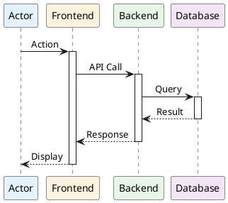

# SEQUENCE DIAGRAMS GUIDE

**Guide for drawing Sequence Diagrams for CollabSphere System**

---

## OVERVIEW

This guide provides step-by-step instructions for creating **10 key Sequence Diagrams** that illustrate critical user interactions and system flows in CollabSphere.

### Diagram Summary

| # | Diagram Name | File Name | UC Reference | Actors | Estimated Time |
|---|-------------|-----------|--------------|--------|----------------|
| 1 | User Authentication Flow | seq-01-authentication.puml | - | User, Frontend, Backend, Database | 45 min |
| 2 | Create Project Flow | seq-02-create-project.puml | UC002 | Lecturer, Frontend, Backend, AI Service, Database | 1 hour |
| 3 | Approve Project Flow | seq-03-approve-project.puml | UC004 | Head, Frontend, Backend, Notification Service, Database | 45 min |
| 4 | Create Team Flow | seq-04-create-team.puml | UC011 | Lecturer, Frontend, Backend, Database | 45 min |
| 5 | Student Picks Project Flow | seq-05-pick-project.puml | UC010 | Student, Frontend, Backend, Database | 45 min |
| 6 | Submit Checkpoint Flow | seq-06-submit-checkpoint.puml | UC018 | Student, Frontend, Backend, Storage, Database | 1 hour |
| 7 | Evaluate Checkpoint Flow | seq-07-evaluate-checkpoint.puml | UC026 | Lecturer, Frontend, Backend, Notification, Database | 45 min |
| 8 | Peer Review Flow | seq-08-peer-review.puml | UC041 | Student, Frontend, Backend, Database | 45 min |
| 9 | Real-time Chat Flow | seq-09-chat-message.puml | UC020 | User, Frontend, WebSocket, Backend, Database | 1 hour |
| 10 | Video Call/Meeting Flow | seq-10-video-call.puml | UC021 | Users, Frontend, WebRTC, Socket.IO, Backend | 1 hour |

**Total Estimated Time:** 8-10 hours

---

## TOOLS & SETUP

### Recommended Tools

1. **PlantUML (Recommended)**
   - Online: https://www.plantuml.com/plantuml/uml/
   - VS Code Extension: "PlantUML" by jebbs
   - Command line: `java -jar plantuml.jar filename.puml`

2. **Draw.io (Alternative)**
   - Web: https://app.diagrams.net/
   - Desktop: Download from diagrams.net
   - Use "UML → Sequence Diagram" template

### PlantUML Advantages
- Text-based, version control friendly
- Auto-layout and alignment
- Easy to update and maintain
- Consistent styling

---

## GENERAL GUIDELINES

### Sequence Diagram Elements

1. **Actors/Participants:**
   - User (Actor)
   - Frontend (React Application)
   - Backend (FastAPI Server)
   - Database (PostgreSQL)
   - External Services (AI, Storage, SMTP, WebSocket, WebRTC)

2. **Message Types:**
   - **Synchronous call:** `->` (solid arrow)
   - **Return/Response:** `-->` (dashed arrow)
   - **Asynchronous message:** `->>` (open arrow)
   - **Create/Destroy:** `create`, `destroy`

3. **Fragments:**
   - **alt/else:** Alternative paths (if/else)
   - **opt:** Optional behavior
   - **loop:** Repeated actions
   - **par:** Parallel execution

### Naming Conventions

- **Participants:** Use clear role names (User, Frontend, Backend, Database)
- **Messages:** Use action verbs (GET, POST, Create, Validate, Send)
- **Labels:** Include HTTP methods for API calls (POST /api/projects)

### Styling Guidelines

- Use colors to distinguish participant types:
  - **Actor:** #E3F2FD (light blue)
  - **Frontend:** #FFF3E0 (light orange)
  - **Backend:** #E8F5E9 (light green)
  - **Database:** #F3E5F5 (light purple)
  - **External:** #FFF9C4 (light yellow)

---

## DIAGRAM DETAILS

### Sequence 1: User Authentication Flow

**Purpose:** Show login/register process with JWT token generation

**Participants:**
- User (Actor)
- Frontend (React)
- Backend (FastAPI)
- Database (PostgreSQL)

**Main Steps:**
1. User enters credentials (email, password)
2. Frontend sends POST /api/auth/login
3. Backend validates credentials
4. Backend queries user from database
5. Backend generates JWT token
6. Backend returns token + user data
7. Frontend stores token in localStorage
8. Frontend redirects to dashboard

**Alternative Flows:**
- Invalid credentials → 401 error
- Account locked → 403 error
- Server error → 500 error

**Key Features:**
- Password hashing validation (bcrypt)
- JWT token generation with expiry
- Error handling for various scenarios

---

### Sequence 2: Create Project Flow

**Purpose:** Lecturer creates project with optional AI milestone generation

**Participants:**
- Lecturer (Actor)
- Frontend (React)
- Backend (FastAPI)
- AI Service (AWS Bedrock)
- Database (PostgreSQL)

**Main Steps:**
1. Lecturer fills project form (title, description, subject)
2. Lecturer optionally clicks "Generate Milestones with AI"
3. Frontend sends POST /api/ai/generate-milestones with description
4. Backend forwards request to AWS Bedrock (Claude)
5. AI Service returns suggested milestones JSON
6. Backend parses and returns milestones
7. Frontend displays milestones in form (editable)
8. Lecturer reviews/edits milestones
9. Lecturer submits form
10. Frontend sends POST /api/projects with full data
11. Backend validates project data
12. Backend saves project to database
13. Backend saves milestones to database
14. Backend returns success with project ID
15. Frontend shows success message and redirects

**Alternative Flows:**
- AI service unavailable → Skip step 3-6, manual entry only
- Validation fails → Return 400 with error details
- Duplicate title → Warning but allow

**Key Features:**
- AI integration for milestone suggestions
- Form validation (title length, required fields)
- Transaction handling (project + milestones atomic)

---

### Sequence 3: Approve Project Flow

**Purpose:** Head of Department approves or denies project

**Participants:**
- Head (Actor)
- Frontend (React)
- Backend (FastAPI)
- Notification Service
- Database (PostgreSQL)

**Main Steps:**
1. Head views pending projects list
2. Frontend sends GET /api/projects?status=pending
3. Backend queries projects from database
4. Backend returns projects with lecturer info
5. Frontend displays projects table
6. Head clicks on a project to review
7. Frontend shows project details with Approve/Deny buttons
8. Head clicks Approve (or Deny with reason)
9. Frontend sends PUT /api/projects/{id}/approve
10. Backend validates Head has permission
11. Backend updates project status to "approved"
12. Backend creates notification for lecturer
13. Backend saves to database
14. Backend returns success
15. Notification Service sends email to lecturer
16. Frontend shows success toast

**Alternative Flows:**
- Deny project → Similar flow but status = "denied", includes denial reason
- No permission → 403 Forbidden error
- Project already processed → 409 Conflict error

**Key Features:**
- Authorization check (Head role required)
- Status transition validation
- Notification system integration
- Email notification asynchronously

---

### Sequence 4: Create Team Flow

**Purpose:** Lecturer creates team and adds members

**Participants:**
- Lecturer (Actor)
- Frontend (React)
- Backend (FastAPI)
- Database (PostgreSQL)

**Main Steps:**
1. Lecturer navigates to class Teams tab
2. Lecturer clicks "Create Team"
3. Frontend shows team creation modal
4. Lecturer enters team name and description
5. Frontend sends POST /api/groups with class_id
6. Backend validates:
   - Team name unique in class
   - Lecturer has permission
7. Backend creates group in database
8. Backend returns group_id and details
9. Frontend closes modal and shows success
10. Lecturer clicks "Add Members"
11. Frontend sends GET /api/classes/{id}/available-students
12. Backend returns students not in teams yet
13. Frontend displays student selection UI
14. Lecturer selects students and assigns roles
15. Frontend sends POST /api/groups/{id}/members (batch)
16. Backend validates team size (3-5 members)
17. Backend adds members to group_members table
18. Backend creates notifications for added students
19. Backend returns updated team with members
20. Frontend refreshes team list

**Alternative Flows:**
- Duplicate team name → 409 error with suggestion
- Team size exceeded → 400 error
- Student already in team → Skip with warning

**Key Features:**
- Multi-step creation (team then members)
- Batch member addition
- Business rule validation (size, uniqueness)
- Real-time member notifications

---

### Sequence 5: Student Picks Project Flow

**Purpose:** Student or team leader selects project for their team

**Participants:**
- Student (Actor)
- Frontend (React)
- Backend (FastAPI)
- Database (PostgreSQL)

**Main Steps:**
1. Student navigates to team workspace
2. Frontend sends GET /api/groups/{id}/available-projects
3. Backend queries approved projects for student's class
4. Backend filters out already-picked projects
5. Backend returns available projects list
6. Frontend displays project cards
7. Student browses projects and reads details
8. Student clicks "Pick This Project"
9. Frontend shows confirmation dialog
10. Student confirms
11. Frontend sends POST /api/groups/{id}/pick-project with project_id
12. Backend validates:
    - Student is team member
    - Project is available
    - Team doesn't have project yet
13. Backend updates group.project_id
14. Backend creates group_milestones from project_milestones
15. Backend marks project as "picked" if single-team
16. Backend creates notifications for team members
17. Backend returns success with project data
18. Frontend shows success and redirects to workspace

**Alternative Flows:**
- Project already picked by another team → 409 error
- Student not in team → 403 error
- Team already has project → 400 error

**Key Features:**
- Availability validation (race condition handling)
- Milestone cloning to group context
- Team-wide notifications
- Atomic transaction (pick + milestones)

---

### Sequence 6: Submit Checkpoint Flow

**Purpose:** Student submits checkpoint with files and description

**Participants:**
- Student (Actor)
- Frontend (React)
- Backend (FastAPI)
- Storage Service (Cloudinary)
- Database (PostgreSQL)

**Main Steps:**
1. Student navigates to milestone checkpoints
2. Frontend displays checkpoints with status
3. Student clicks on pending checkpoint
4. Frontend shows submission form
5. Student enters submission text
6. Student selects files to upload (< 100MB total)
7. Student clicks "Submit"
8. Frontend validates file types and sizes
9. **For each file:**
   - Frontend uploads to Cloudinary directly
   - Cloudinary returns file URL
10. Frontend collects all file URLs
11. Frontend sends POST /api/checkpoint-submissions with:
    - checkpoint_id
    - submission_text
    - file_urls array
12. Backend validates:
    - Student is in team
    - Checkpoint not already submitted
    - Deadline not passed (or allow with late flag)
13. Backend creates checkpoint_submission record
14. Backend updates checkpoint status to "submitted"
15. Backend creates notification for lecturer
16. Backend returns submission details
17. Frontend shows success message

**Alternative Flows:**
- File upload fails → Retry 3 times, then show error
- File too large → Client-side validation error
- Late submission → Save but mark as late, penalty applied
- Network error → Save draft locally, retry later

**Key Features:**
- Multiple file uploads to external storage
- Client-side validation before upload
- Late submission handling
- Transaction with status update

---

### Sequence 7: Evaluate Checkpoint Flow

**Purpose:** Lecturer reviews and grades checkpoint submission

**Participants:**
- Lecturer (Actor)
- Frontend (React)
- Backend (FastAPI)
- Notification Service
- Database (PostgreSQL)

**Main Steps:**
1. Lecturer views team milestone checkpoints
2. Frontend sends GET /api/groups/{id}/checkpoints
3. Backend returns checkpoints with submission status
4. Frontend highlights submitted checkpoints
5. Lecturer clicks on submitted checkpoint
6. Frontend sends GET /api/checkpoint-submissions/{id}
7. Backend returns full submission with files
8. Frontend displays submission with download links
9. Lecturer reviews text and downloads files
10. Lecturer enters grade and feedback
11. Lecturer clicks "Submit Evaluation"
12. Frontend sends POST /api/checkpoint-evaluations with:
    - checkpoint_submission_id
    - grade (0-10)
    - feedback_text
13. Backend validates:
    - Lecturer owns the class
    - Submission exists
    - Not already evaluated
14. Backend creates checkpoint_evaluation record
15. Backend updates submission.evaluated = true
16. Backend creates notification for submitter
17. Backend saves to database
18. Backend returns evaluation details
19. Notification Service sends email to student
20. Frontend shows success and updates UI

**Alternative Flows:**
- Already evaluated → Allow re-evaluation with confirmation
- Invalid grade range → 400 validation error

**Key Features:**
- File download from Cloudinary URLs
- Grade validation (0-10 scale)
- One-to-one evaluation (checkpoint → evaluation)
- Notification to submission author

---

### Sequence 8: Peer Review Flow

**Purpose:** Student evaluates team members at milestone end

**Participants:**
- Student (Actor)
- Frontend (React)
- Backend (FastAPI)
- Database (PostgreSQL)

**Main Steps:**
1. System triggers peer review period (milestone completed)
2. Student receives notification "Peer Review Available"
3. Student navigates to "Peer Reviews"
4. Frontend sends GET /api/peer-reviews/available
5. Backend returns team members to review (excluding self)
6. Frontend displays review form for each member
7. For each member, student rates:
   - Cooperation score (1-5)
   - Contribution score (1-5)
   - Communication score (1-5)
   - Technical skills score (1-5)
   - Comments (optional text)
8. Student submits all reviews
9. Frontend sends POST /api/peer-reviews (batch) with array:
   - reviewer_id (current user)
   - reviewee_id (team member)
   - 4 score fields
   - comments
10. Backend validates:
    - Student in team
    - Not reviewing self
    - Review period active
    - Scores in range (1-5)
11. Backend creates peer_review records (batch insert)
12. Backend marks reviews as completed for student
13. Backend returns success
14. Frontend shows "Thank you" message

**Alternative Flows:**
- Review already submitted → Show previous review, allow edit
- Review period ended → 403 error "Review period closed"
- Invalid scores → 400 validation error per field

**Key Features:**
- Multi-member review in one submission
- 4-dimensional scoring system
- Self-review prevention
- Time-limited review period
- Anonymity (reviewee doesn't see who reviewed)

---

### Sequence 9: Real-time Chat Flow

**Purpose:** Send and receive chat messages via WebSocket

**Participants:**
- User (Actor)
- Frontend (React)
- WebSocket Service (Socket.IO)
- Backend (FastAPI)
- Database (PostgreSQL)

**Main Steps:**
1. User opens team workspace
2. Frontend establishes WebSocket connection
3. Frontend sends "join_room" event with team_id
4. WebSocket Service authenticates token
5. WebSocket Service adds user to team room
6. Frontend sends GET /api/chat-messages?team_id={id}&limit=50
7. Backend queries recent messages from database
8. Backend returns messages with sender info
9. Frontend displays chat history
10. **Sending Message:**
    - User types message and clicks Send
    - Frontend emits "send_message" event via WebSocket with:
      - team_id
      - message_text
      - (optional) attachment_url
11. WebSocket Service receives event
12. WebSocket Service validates user in team
13. WebSocket Service saves message to database
14. WebSocket Service broadcasts "new_message" to all room members
15. All connected clients (including sender) receive message
16. Frontend appends message to chat UI
17. Backend creates notifications for @mentions if any

**Alternative Flows:**
- WebSocket disconnected → Queue messages locally, resend on reconnect
- Message too long (> 2000 chars) → Truncate or reject
- Attachment upload → Similar to checkpoint files, upload first then send URL
- Edit message (within 5 min) → emit "edit_message" event
- Delete message → emit "delete_message" event

**Key Features:**
- Persistent WebSocket connection
- Room-based broadcasting
- Message history pagination
- Real-time updates (< 500ms latency)
- Offline message queueing
- @mention notifications

---

### Sequence 10: Video Call/Meeting Flow

**Purpose:** Initiate and join video/audio call using WebRTC

**Participants:**
- User A (Caller)
- User B (Callee)
- Frontend A & B (React)
- Socket.IO Service
- Backend (FastAPI)
- STUN/TURN Servers

**Main Steps:**
1. **Initiate Call:**
   - User A clicks "Start Video Call"
   - Frontend A creates meeting record
   - Frontend A sends POST /api/meetings with team_id
   - Backend creates meeting in database
   - Backend returns meeting_id
   - Frontend A emits "call_initiated" event with meeting_id to team room
   - Socket.IO broadcasts to all team members

2. **Receive Call:**
   - Frontend B receives "incoming_call" event
   - Frontend B shows call notification modal
   - User B clicks "Join"
   - Frontend B emits "join_call" event

3. **WebRTC Handshake:**
   - Frontend A creates RTCPeerConnection
   - Frontend A gets local media stream (camera/mic)
   - Frontend A creates offer (SDP)
   - Frontend A emits "webrtc_offer" to User B via Socket.IO
   - Frontend B receives offer
   - Frontend B creates RTCPeerConnection
   - Frontend B gets local media stream
   - Frontend B sets remote description (offer)
   - Frontend B creates answer (SDP)
   - Frontend B emits "webrtc_answer" to User A
   - Frontend A receives answer
   - Frontend A sets remote description
   - ICE candidates exchanged via "webrtc_ice_candidate" events

4. **Call Active:**
   - Media streams flowing via P2P WebRTC
   - Frontend displays remote video/audio
   - User can toggle mic/camera
   - User can share screen

5. **End Call:**
   - User A clicks "Leave"
   - Frontend A closes RTCPeerConnection
   - Frontend A emits "leave_call" event
   - Socket.IO notifies other participants
   - If last user, Backend updates meeting.ended_at
   - Frontend shows "Call ended"

**Alternative Flows:**
- WebRTC connection fails → Fallback to TURN server
- User rejects call → Emit "call_rejected"
- Network poor → Reduce video quality dynamically
- Screen share → Create additional video track

**Key Features:**
- Peer-to-peer WebRTC for low latency
- SDP offer/answer exchange via signaling server
- ICE candidate exchange for NAT traversal
- STUN/TURN server fallback
- Multiple participants support
- Real-time media controls

---

## PLANTUML TEMPLATES

### Basic Template



### Template with Alt/Opt

```plantuml
alt Success Case
    backend -> db: Save data
    db --> backend: Success
else Error Case
    backend --> frontend: Error 400
    frontend --> actor: Show error
end

opt Optional Step
    backend -> external: API Call
end
```

---

## RENDERING INSTRUCTIONS

### Using PlantUML Online

1. Go to https://www.plantuml.com/plantuml/uml/
2. Copy PlantUML code from `.puml` file
3. Paste into text area
4. Click "Submit"
5. Download PNG (200% size recommended)
6. Save as `4.3.7-seq-{name}.png` in `Documentation/04-SDD/diagrams/`

### Using VS Code Extension

1. Install "PlantUML" extension by jebbs
2. Open `.puml` file
3. Press `Alt+D` to preview
4. Right-click on preview → Export diagram
5. Choose PNG format and location
6. Set resolution to 300 DPI

### Using Command Line

```bash
# Install PlantUML
# Download plantuml.jar from plantuml.com

# Render single file
java -jar plantuml.jar filename.puml

# Render all files in directory
java -jar plantuml.jar *.puml

# High resolution export
java -jar plantuml.jar -tpng -charset UTF-8 filename.puml
```

---

## COMPLETION CHECKLIST

Use this checklist to track completion of all 10 sequence diagrams:

### PlantUML Code Files Created
- [ ] seq-01-authentication.puml (Login/Register)
- [ ] seq-02-create-project.puml (Create Project with AI)
- [ ] seq-03-approve-project.puml (Head Approves Project)
- [ ] seq-04-create-team.puml (Lecturer Creates Team)
- [ ] seq-05-pick-project.puml (Student Picks Project)
- [ ] seq-06-submit-checkpoint.puml (Submit Checkpoint)
- [ ] seq-07-evaluate-checkpoint.puml (Evaluate Checkpoint)
- [ ] seq-08-peer-review.puml (Peer Review)
- [ ] seq-09-chat-message.puml (Real-time Chat)
- [ ] seq-10-video-call.puml (Video Call WebRTC)

### PNG Diagrams Rendered
- [ ] 4.3.7-seq-authentication.png
- [ ] 4.3.8-seq-create-project.png
- [ ] 4.3.9-seq-approve-project.png
- [ ] 4.3.10-seq-create-team.png
- [ ] 4.3.11-seq-pick-project.png
- [ ] 4.3.12-seq-submit-checkpoint.png
- [ ] 4.3.13-seq-evaluate-checkpoint.png
- [ ] 4.3.14-seq-peer-review.png
- [ ] 4.3.15-seq-chat-message.png
- [ ] 4.3.16-seq-video-call.png

### Documentation Inserted
- [ ] All 10 diagrams inserted into 4.3-DetailedDesign.md at appropriate sections
- [ ] Captions and descriptions added for each diagram
- [ ] Cross-references to UC verified

### Quality Checks
- [ ] All participants clearly labeled
- [ ] All messages have clear descriptions
- [ ] Error/alternative flows shown with alt/opt fragments
- [ ] Activation bars used correctly
- [ ] Return messages shown with dashed arrows
- [ ] Colors consistent across all diagrams
- [ ] Resolution sufficient for readability (300 DPI minimum)

---

## TIPS & BEST PRACTICES

1. **Keep It Simple:** Don't overcrowd diagrams. Focus on main flow, use notes for details.

2. **Use Consistent Naming:** Same participant names across all diagrams (e.g., always "Backend" not "API Server").

3. **Show Error Paths:** Use `alt/else` for important error scenarios, don't ignore failures.

4. **Include API Details:** Show HTTP methods and endpoints in message labels (e.g., "POST /api/projects").

5. **Group Related Steps:** Use fragments to show loops, optional steps, parallel execution.

6. **Add Notes:** Use PlantUML notes for additional context:
   ```
   note right of Backend: JWT token expires in 24h
   ```

7. **Test Rendering:** Always preview diagrams before finalizing. Check for:
   - Overlapping arrows
   - Unclear message labels
   - Missing return messages
   - Inconsistent spacing

8. **Version Control:** Commit `.puml` source files to git, not just PNG images.

9. **Documentation:** Add brief description above each diagram in markdown explaining the scenario.

10. **Maintenance:** When system changes, update sequence diagrams immediately to keep docs in sync.

---

## REFERENCES

- **UC Details:** See `Documentation/03-SRS/3.2-UserRequirements.md`
- **API Endpoints:** See `Documentation/04-SDD/4.3-DetailedDesign.md`
- **Architecture:** See `Documentation/04-SDD/4.1-SystemDesign.md`
- **PlantUML Documentation:** https://plantuml.com/sequence-diagram
- **WebRTC Documentation:** https://webrtc.org/getting-started/overview
- **Socket.IO Events:** See `collabsphere/backend/app/services/socket_service.py`

---

**Guide Version:** 1.0  
**Last Updated:** January 5, 2026  
**Author:** CollabSphere Team  
**Estimated Total Time:** 8-10 hours for all 10 diagrams
