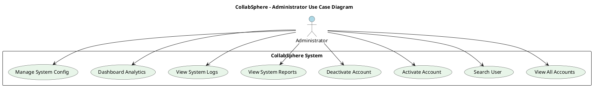
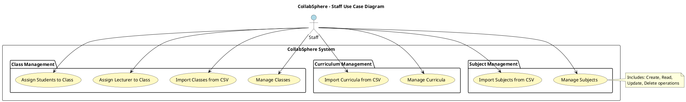
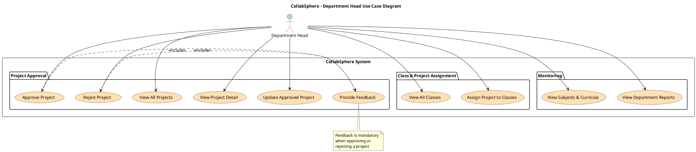

# 🎨 PLANTUML CODE - USE CASE DIAGRAMS

**Mục đích**: Vẽ nhanh 5 Use Case Diagrams bằng code thay vì kéo thả  
**Công cụ**: PlantUML (https://plantuml.com/)

---

## 🚀 CÁCH SỬ DỤNG

### **Option 1: Online Editor (Khuyên dùng)**
1. Truy cập: https://www.plantuml.com/plantuml/uml/
2. Copy code từ dưới đây
3. Paste vào editor
4. Click "Submit" để xem kết quả
5. Download PNG

### **Option 2: VS Code Extension**
1. Cài extension: "PlantUML" (jebbs.plantuml)
2. Tạo file `.puml` (VD: `use-case-admin.puml`)
3. Paste code
4. Right-click → "PlantUML: Export Current Diagram"

### **Option 3: Command Line**
```bash
# Cài PlantUML
npm install -g node-plantuml
# hoặc
pip install plantuml

# Generate PNG
plantuml use-case-admin.puml
```

---

## 📝 1. ADMIN USE CASE DIAGRAM

**File**: `use-case-admin.puml`



---

## 📝 2. STAFF USE CASE DIAGRAM

**File**: `use-case-staff.puml`



---

## 📝 3. DEPARTMENT HEAD USE CASE DIAGRAM

**File**: `use-case-head.puml`



---

## 📝 4. LECTURER USE CASE DIAGRAM

**File**: `use-case-lecturer.puml`

```plantuml
@startuml use-case-lecturer
skinparam monochrome false
skinparam backgroundColor #FFFFFF
skinparam actorBackgroundColor #E3F2FD
skinparam usecaseBackgroundColor #E1F5FE

title CollabSphere - Lecturer Use Case Diagram

' Actor
actor "Lecturer" as Lecturer #lightblue

' System boundary
rectangle "CollabSphere System" {
  
  usecase "Manage Projects" as UC1
  usecase "Manage Groups" as UC2
  usecase "Manage Milestones\n& Checkpoints" as UC3
  usecase "Manage Resources" as UC4
  usecase "Evaluate Students" as UC5
  usecase "Communication" as UC6
  usecase "Track Progress\n& Analytics" as UC7
  usecase "AI Assistant" as UC8
}

' Associations
Lecturer --> UC1
Lecturer --> UC2
Lecturer --> UC3
Lecturer --> UC4
Lecturer --> UC5
Lecturer --> UC6
Lecturer --> UC7
Lecturer --> UC8

' Notes with details
note right of UC1
  • Create Project
  • AI Generate Milestones
  • Submit for Approval
  • Assign to Class
end note

note right of UC2
  • Create Groups
  • Add/Remove Members
  • Assign Project to Group
  • Set Group Leader
end note

note right of UC3
  • Create Milestone Questions
  • View Answers
  • View Checkpoint Submissions
  • Evaluate Checkpoints
end note

note right of UC4
  • Upload Class Resources
  • Upload Group Resources
  • Organize Folders
  • Share Resources
end note

note right of UC5
  • Evaluate Groups
  • Evaluate Members
  • Evaluate Checkpoints
  • View Peer Reviews
end note

note right of UC6
  • Chat with Groups
  • Schedule Meetings
  • Join Video Meetings
  • Send Notifications
end note

note right of UC7
  • View Group Progress
  • Track Member Contribution
  • AI Progress Analysis
  • Generate Reports
end note

note right of UC8
  • Use AI Chatbot
  • AI Generate Milestones
  • AI Progress Analysis
end note

@enduml
```



---

## 📝 5. STUDENT USE CASE DIAGRAM

**File**: `use-case-student.puml`

```plantuml
@startuml use-case-student
skinparam monochrome false
skinparam backgroundColor #FFFFFF
skinparam actorBackgroundColor #E3F2FD
skinparam usecaseBackgroundColor #F3E5F5

title CollabSphere - Student Use Case Diagram

' Actors
actor "Student" as Student #lightblue
actor "Group Leader" as Leader #orange

' Generalization
Leader -up-|> Student : extends

' System boundary
rectangle "CollabSphere System" {
  
  package "View & Information" {
    usecase "View Classes" as UC1
    usecase "View Group Details" as UC2
    usecase "View Projects" as UC3
    usecase "View Group Progress" as UC4
  }
  
  package "Milestone & Checkpoint" {
    usecase "Mark Milestone Complete" as UC5
    usecase "Answer Milestone Questions" as UC6
    usecase "Create Checkpoint" as UC7
    usecase "Submit Checkpoint" as UC8
  }
  
  package "Task Management" {
    usecase "View Tasks" as UC9
    usecase "Create Task" as UC10
    usecase "Assign Task" as UC11
    usecase "Update Task Status" as UC12
  }
  
  package "Resources & Evaluation" {
    usecase "View Resources" as UC13
    usecase "Upload Resources" as UC14
    usecase "Peer Review" as UC15
    usecase "View Evaluations" as UC16
  }
  
  package "Collaboration" {
    usecase "Chat with Group" as UC17
    usecase "Join Video Meeting" as UC18
    usecase "Use Whiteboard" as UC19
    usecase "Use Code Editor" as UC20
    usecase "Use AI Chatbot" as UC21
  }
}

' Student associations
Student --> UC1
Student --> UC2
Student --> UC3
Student --> UC4
Student --> UC6
Student --> UC8
Student --> UC9
Student --> UC10
Student --> UC11
Student --> UC12
Student --> UC13
Student --> UC14
Student --> UC15
Student --> UC16
Student --> UC17
Student --> UC18
Student --> UC19
Student --> UC20
Student --> UC21

' Group Leader only
Leader --> UC5
Leader --> UC7

' Notes
note right of UC5
  Only Group Leader
  can mark milestones
  as complete
end note

note right of UC7
  Only Group Leader
  can create new
  checkpoints
end note

note bottom of UC15
  Can be anonymous
  or public based on
  lecturer settings
end note

@enduml
```



---

## 📝 ALL IN ONE FILE (Optional)

Nếu muốn tất cả trong 1 file để dễ quản lý:

**File**: `all-use-cases.puml`

```plantuml
@startuml all-use-cases

title CollabSphere - All Use Cases Overview

' Define actors with colors
actor "Administrator" as Admin #lightblue
actor "Staff" as Staff #lightgreen
actor "Department Head" as Head #yellow
actor "Lecturer" as Lecturer #orange
actor "Student" as Student #pink
actor "Group Leader" as Leader #red

' Inheritance
Leader -up-|> Student : extends

' System boundary
rectangle "CollabSphere System" {
  
  package "User Management" {
    usecase "View All Accounts" as A1
    usecase "Activate/Deactivate Account" as A2
  }
  
  package "Academic Management" {
    usecase "Manage Subjects" as S1
    usecase "Manage Curricula" as S2
    usecase "Manage Classes" as S3
  }
  
  package "Project Management" {
    usecase "Create Project" as L1
    usecase "Approve Project" as H1
    usecase "Assign Project to Classes" as H2
  }
  
  package "Group Management" {
    usecase "Create Groups" as L2
    usecase "View Group Progress" as L3
  }
  
  package "Collaboration" {
    usecase "Chat & Meetings" as C1
    usecase "Whiteboard & Editor" as C2
  }
  
  package "Evaluation" {
    usecase "Evaluate Students" as L4
    usecase "Peer Review" as ST1
  }
  
  package "AI Features" {
    usecase "AI Chatbot" as AI1
    usecase "AI Generate Milestones" as AI2
  }
}

' Admin associations
Admin --> A1
Admin --> A2

' Staff associations
Staff --> S1
Staff --> S2
Staff --> S3

' Head associations
Head --> H1
Head --> H2

' Lecturer associations
Lecturer --> L1
Lecturer --> L2
Lecturer --> L3
Lecturer --> L4
Lecturer --> AI2

' Student associations
Student --> ST1
Student --> C1
Student --> C2
Student --> AI1

' Group Leader additional
Leader --> L3

@enduml
```



---

## 🎨 CUSTOMIZATION

### Thay đổi màu sắc:
```plantuml
skinparam actorBackgroundColor #your-color
skinparam usecaseBackgroundColor #your-color
skinparam usecaseBorderColor #your-color
```

### Thay đổi font:
```plantuml
skinparam defaultFontName Arial
skinparam defaultFontSize 12
```

### Thay đổi style:
```plantuml
skinparam style strictuml
' hoặc
skinparam handwritten true
```

### Thêm màu cho từng use case:
```plantuml
usecase "Important Task" as UC1 #FF6B6B
usecase "Normal Task" as UC2 #4ECDC4
```

---

## ⚡ QUICK GENERATE ALL

Script để generate tất cả diagrams một lần:

**File**: `generate-all.sh` (Linux/Mac)
```bash
#!/bin/bash

# Generate all use case diagrams
plantuml use-case-admin.puml
plantuml use-case-staff.puml
plantuml use-case-head.puml
plantuml use-case-lecturer.puml
plantuml use-case-student.puml

# Move to output folder
mkdir -p ../use-case
mv *.png ../use-case/

echo "✅ Generated 5 use case diagrams in ../use-case/"
```

**File**: `generate-all.ps1` (Windows PowerShell)
```powershell
# Generate all use case diagrams
plantuml use-case-admin.puml
plantuml use-case-staff.puml
plantuml use-case-head.puml
plantuml use-case-lecturer.puml
plantuml use-case-student.puml

# Move to output folder
New-Item -ItemType Directory -Force -Path ..\use-case
Move-Item -Path *.png -Destination ..\use-case\

Write-Host "✅ Generated 5 use case diagrams in ..\use-case\"
```

---

## 📦 EXPORT OPTIONS

### Export PNG (High Quality)
```bash
plantuml -tpng -Sresolution=300 use-case-admin.puml
```

### Export SVG (Vector)
```bash
plantuml -tsvg use-case-admin.puml
```

### Export PDF
```bash
plantuml -tpdf use-case-admin.puml
```

---

## ✅ CHECKLIST

- [ ] Copy code cho diagram 1 (Admin)
- [ ] Copy code cho diagram 2 (Staff)
- [ ] Copy code cho diagram 3 (Department Head)
- [ ] Copy code cho diagram 4 (Lecturer)
- [ ] Copy code cho diagram 5 (Student)
- [ ] Generate PNG cho tất cả
- [ ] Lưu vào folder `use-case/`
- [ ] Đổi tên file theo convention: `use-case-[role].png`

---

## 🎯 KẾT QUẢ

Sau khi chạy code, bạn sẽ có 5 file PNG:
```
use-case/
├── use-case-admin.png
├── use-case-staff.png
├── use-case-head.png
├── use-case-lecturer.png
└── use-case-student.png
```

---

## 💡 SO SÁNH: PLANTUML vs DRAW.IO

| Tiêu chí | PlantUML | Draw.io |
|----------|----------|---------|
| **Tốc độ** | ⚡ Nhanh (viết code) | 🐌 Chậm (kéo thả) |
| **Chỉnh sửa** | ⚡ Dễ (edit code) | 🐌 Khó (di chuyển lại) |
| **Version Control** | ✅ Tốt (text file) | ❌ Khó (XML) |
| **Chất lượng** | ⭐⭐⭐⭐ Tốt | ⭐⭐⭐⭐⭐ Rất tốt |
| **Control Layout** | ❌ Tự động | ✅ Thủ công 100% |
| **Learning Curve** | 📚 Cần học syntax | 👍 Dễ học |

**Khuyến nghị**: 
- Dùng **PlantUML** nếu muốn nhanh và dễ chỉnh sửa
- Dùng **Draw.io** nếu muốn control layout 100%

---

## 🚀 NEXT STEPS

Sau khi có Use Case Diagrams, tiếp tục với:
→ Class Diagrams (có PlantUML code ở file `02-CLASS-PLANTUML.md`)
→ Sequence Diagrams (có PlantUML code ở file `03-SEQUENCE-PLANTUML.md`)

**Good luck!** 🎨
