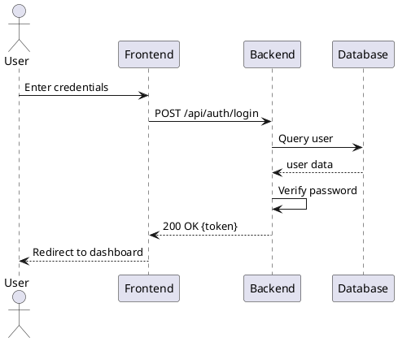

# 📐 GIAI ĐOẠN 3: SEQUENCE DIAGRAMS

**Thời gian ước tính**: 10 giờ (10 diagrams)  
**Công cụ khuyên dùng**: Draw.io hoặc PlantUML  
**Output**: 10 file PNG trong folder `diagrams/sequence/`

---

## 🎯 MỤC TIÊU

Vẽ 10 Sequence Diagrams cho các luồng quan trọng:
1. User Login (Đăng nhập)
2. User Registration (Đăng ký)
3. Create Project (Tạo dự án)
4. Approve Project (Phê duyệt dự án)
5. Create Group (Tạo nhóm)
6. Submit Checkpoint (Nộp checkpoint)
7. Send Chat Message (Gửi tin nhắn)
8. Video Call (Gọi video)
9. Peer Review (Đánh giá đồng nghiệp)
10. AI Chatbot (Trò chuyện với AI)

---

## 📖 KIẾN THỨC CƠ BẢN

### Sequence Diagram là gì?
- Mô tả **luồng tương tác** giữa các objects theo thời gian
- Thể hiện **thứ tự** các messages/method calls
- Thể hiện **lifecycle** của objects

### Các thành phần chính:

#### 1. **Actor** (Người dùng)
```
  [👤]
  User
```
- Hình người que hoặc stick figure

#### 2. **Object/Participant** (Đối tượng)
```
┌──────────────┐
│  ObjectName  │
└──────────────┘
       │
       │ Lifeline (đường đời)
       │
```

#### 3. **Lifeline** (Đường đời)
- Đường thẳng đứng từ object xuống dưới
- Thể hiện thời gian tồn tại của object

#### 4. **Activation Box** (Hộp kích hoạt)
```
       │
       ▐ ← Activation (object đang xử lý)
       ▐
       │
```

#### 5. **Messages** (Thông điệp)

**a. Synchronous Message (Đồng bộ)**
```
Object A  ────────>  Object B
          method()
```
- Mũi tên đặc
- Gọi method và đợi kết quả

**b. Asynchronous Message (Không đồng bộ)**
```
Object A  ──────>  Object B
          notify()
```
- Mũi tên rỗng
- Gửi message và không đợi

**c. Return Message (Trả về)**
```
Object A  <┄┄┄┄┄┄  Object B
          result
```
- Đường đứt nét
- Trả kết quả về

**d. Self Message (Tự gọi)**
```
       │
       ├──┐
       │  │ validate()
       │<─┘
       │
```

#### 6. **Alternative Flow (Nhánh)**
```
┌─ alt [condition] ─────────┐
│  [true]                    │
│    ──> action1()           │
├────────────────────────────┤
│  [else]                    │
│    ──> action2()           │
└────────────────────────────┘
```

#### 7. **Loop (Vòng lặp)**
```
┌─ loop [for each item] ────┐
│    ──> process()           │
└────────────────────────────┘
```

#### 8. **Optional (Tùy chọn)**
```
┌─ opt [if condition] ──────┐
│    ──> action()            │
└────────────────────────────┘
```

---

## 🚀 HƯỚNG DẪN VẼ BẰNG DRAW.IO

### Bước 1: Chuẩn bị
1. Mở https://app.diagrams.net/
2. Create New Diagram → UML → Sequence Diagram
3. Sidebar có: Actor, Lifeline, Messages, Fragments

### Bước 2: Vẽ Participants
1. Kéo "Lifeline" shapes từ sidebar
2. Đặt tên cho mỗi participant
3. Sắp xếp từ trái sang phải theo thứ tự tương tác

### Bước 3: Vẽ Messages
1. Chọn "Message" từ sidebar
2. Nối từ lifeline này sang lifeline khác
3. Label message với tên method/action

### Bước 4: Thêm Activation Boxes
1. Vẽ hình chữ nhật mỏng trên lifeline
2. Đại diện cho thời gian object đang active

### Bước 5: Thêm Fragments (nếu cần)
- Alt, Opt, Loop cho logic phức tạp

---

## 📝 DIAGRAM 1: USER LOGIN

### **File name**: `seq-01-login.png`

### **Mô tả**: Luồng đăng nhập của user

### **Participants**:
1. 👤 User
2. Frontend (React)
3. Backend API (FastAPI)
4. Database (PostgreSQL)
5. JWT Service

### **Luồng chính**:

```
User    Frontend    Backend    Database    JWTService
 │         │           │           │            │
 │ Enter   │           │           │            │
 │ username│           │           │            │
 │ password│           │           │            │
 ├────────>│           │           │            │
 │         │           │           │            │
 │         │ POST /api/auth/login  │            │
 │         ├──────────>│           │            │
 │         │           │           │            │
 │         │           │ Validate  │            │
 │         │           │ Input     │            │
 │         │           ├──┐        │            │
 │         │           │<─┘        │            │
 │         │           │           │            │
 │         │           │ Query user by username │
 │         │           ├──────────>│            │
 │         │           │           │            │
 │         │           │<┄┄┄┄┄┄┄┄┄│            │
 │         │           │ user data │            │
 │         │           │           │            │
 │         │   ┌─ alt [user exists] ─────────┐ │
 │         │   │       │           │          │ │
 │         │   │ [yes] │           │          │ │
 │         │   │       │ Verify    │          │ │
 │         │   │       │ password  │          │ │
 │         │   │       ├──┐        │          │ │
 │         │   │       │<─┘        │          │ │
 │         │   │       │           │          │ │
 │         │   │ ┌─ alt [password correct] ─┐│ │
 │         │   │ │     │           │        ││ │
 │         │   │ │[yes]│ Generate  │        ││ │
 │         │   │ │     │ JWT token │        ││ │
 │         │   │ │     ├───────────────────>││ │
 │         │   │ │     │           │ create ││ │
 │         │   │ │     │           │  token ││ │
 │         │   │ │     │<┄┄┄┄┄┄┄┄┄┄┄┄┄┄┄┄┄┄││ │
 │         │   │ │     │ access_token       ││ │
 │         │   │ │     │           │        ││ │
 │         │   │ │     │ Update last_login  ││ │
 │         │   │ │     ├──────────>│        ││ │
 │         │   │ │     │           │        ││ │
 │         │   │ │     │<┄┄┄┄┄┄┄┄┄│        ││ │
 │         │   │ │     │  success  │        ││ │
 │         │   │ ├─────────────────────────┤│ │
 │         │   │ │[else]                   ││ │
 │         │   │ │     │ Return 401         ││ │
 │         │   │ │     │ "Invalid password" ││ │
 │         │   │ └─────────────────────────┘│ │
 │         │   ├──────────────────────────────┤
 │         │   │ [else - user not found]      │
 │         │   │       │ Return 404           │
 │         │   │       │ "User not found"     │
 │         │   └──────────────────────────────┘
 │         │           │           │            │
 │         │<┄┄┄┄┄┄┄┄┄│           │            │
 │         │ 200: {    │           │            │
 │         │ access_   │           │            │
 │         │  token,   │           │            │
 │         │ user_data │           │            │
 │         │ }         │           │            │
 │         │           │           │            │
 │         │ Save token│           │            │
 │         │ to local  │           │            │
 │         │ storage   │           │            │
 │         ├──┐        │           │            │
 │         │<─┘        │           │            │
 │         │           │           │            │
 │<┄┄┄┄┄┄┄│           │           │            │
 │ Redirect│           │           │            │
 │ to dash │           │           │            │
 │         │           │           │            │
```

### **Chi tiết implementation**:
- **Endpoint**: `POST /api/auth/login`
- **Request**: `{"username": "john", "password": "pass123"}`
- **Response**: `{"access_token": "jwt...", "token_type": "bearer"}`
- **Error codes**: 401 (Invalid credentials), 404 (User not found)

---

## 📝 DIAGRAM 2: USER REGISTRATION

### **File name**: `seq-02-register.png`

### **Participants**:
1. 👤 User
2. Frontend
3. Backend API
4. Database

### **Luồng chính**:

```
User    Frontend    Backend    Database
 │         │           │           │
 │ Fill    │           │           │
 │ register│           │           │
 │ form    │           │           │
 ├────────>│           │           │
 │         │           │           │
 │         │ Validate  │           │
 │         │ form      │           │
 │         ├──┐        │           │
 │         │<─┘        │           │
 │         │           │           │
 │         │ POST /api/auth/register│
 │         ├──────────>│           │
 │         │           │           │
 │         │           │ Validate  │
 │         │           │ input     │
 │         │           ├──┐        │
 │         │           │<─┘        │
 │         │           │           │
 │         │           │ Check username exists
 │         │           ├──────────>│
 │         │           │           │
 │         │           │<┄┄┄┄┄┄┄┄┄│
 │         │           │  result   │
 │         │           │           │
 │         │   ┌─ alt [username available] ──┐
 │         │   │       │           │          │
 │         │   │ [yes] │           │          │
 │         │   │       │ Hash      │          │
 │         │   │       │ password  │          │
 │         │   │       ├──┐        │          │
 │         │   │       │<─┘        │          │
 │         │   │       │           │          │
 │         │   │       │ Create user record   │
 │         │   │       ├──────────>│          │
 │         │   │       │           │          │
 │         │   │       │<┄┄┄┄┄┄┄┄┄│          │
 │         │   │       │ user_id   │          │
 │         │   │       │           │          │
 │         │   │       │ Send welcome email   │
 │         │   │       ├──┐        │          │
 │         │   │       │<─┘ (async)│          │
 │         │   ├──────────────────────────────┤
 │         │   │ [else]│           │          │
 │         │   │       │ Return 400│          │
 │         │   │       │ "Username │          │
 │         │   │       │  exists"  │          │
 │         │   └──────────────────────────────┘
 │         │           │           │
 │         │<┄┄┄┄┄┄┄┄┄│           │
 │         │ 201:      │           │
 │         │ user_data │           │
 │         │           │           │
 │<┄┄┄┄┄┄┄│           │           │
 │ Show    │           │           │
 │ success │           │           │
 │ message │           │           │
```

---

## 📝 DIAGRAM 3: CREATE PROJECT

### **File name**: `seq-03-create-project.png`

### **Participants**:
1. 👤 Lecturer
2. Frontend
3. Backend API
4. Database
5. AI Service (AWS Bedrock)

### **Luồng chính**:

```
Lecturer  Frontend   Backend   Database   AI_Service
   │         │          │          │           │
   │ Fill    │          │          │           │
   │ project │          │          │           │
   │ form    │          │          │           │
   ├────────>│          │          │           │
   │         │          │          │           │
   │         │ Click    │          │           │
   │         │ "AI      │          │           │
   │         │ Generate │          │           │
   │         │ Milestones"        │           │
   │         ├─────────>│          │           │
   │         │          │          │           │
   │         │          │ POST /api/ai/generate-milestones
   │         │          ├────────────────────>│
   │         │          │ {title,  │           │
   │         │          │  description}        │
   │         │          │          │           │
   │         │          │<┄┄┄┄┄┄┄┄┄┄┄┄┄┄┄┄┄┄┄│
   │         │          │ suggested_milestones │
   │         │          │          │           │
   │         │<┄┄┄┄┄┄┄┄│          │           │
   │         │ Display  │          │           │
   │         │ milestones│         │           │
   │<┄┄┄┄┄┄┄│          │          │           │
   │ Review  │          │          │           │
   │ & edit  │          │          │           │
   │         │          │          │           │
   │ Submit  │          │          │           │
   ├────────>│          │          │           │
   │         │          │          │           │
   │         │ POST /api/projects   │           │
   │         ├─────────>│          │           │
   │         │          │          │           │
   │         │          │ Validate │           │
   │         │          │ data     │           │
   │         │          ├──┐       │           │
   │         │          │<─┘       │           │
   │         │          │          │           │
   │         │          │ Create project       │
   │         │          ├─────────>│           │
   │         │          │          │           │
   │         │          │<┄┄┄┄┄┄┄┄│           │
   │         │          │ project_id           │
   │         │          │          │           │
   │         │   ┌─ loop [for each milestone] ─┐
   │         │   │      │          │           │
   │         │   │      │ Create   │           │
   │         │   │      │ milestone│           │
   │         │   │      ├─────────>│           │
   │         │   │      │          │           │
   │         │   │      │<┄┄┄┄┄┄┄┄│           │
   │         │   └──────────────────────────────┘
   │         │          │          │           │
   │         │          │ Create   │           │
   │         │          │ notification         │
   │         │          │ for Head │           │
   │         │          ├─────────>│           │
   │         │          │          │           │
   │         │<┄┄┄┄┄┄┄┄│          │           │
   │         │ 201:     │          │           │
   │         │ project  │          │           │
   │         │ data     │          │           │
   │<┄┄┄┄┄┄┄│          │          │           │
   │ Success │          │          │           │
   │ message │          │          │           │
```

---

## 📝 DIAGRAM 4: APPROVE PROJECT

### **File name**: `seq-04-approve-project.png`

### **Participants**:
1. 👤 Department Head
2. Frontend
3. Backend API
4. Database
5. Notification Service

### **Luồng chính**:

```
Head     Frontend   Backend   Database   NotifService
 │          │          │          │            │
 │ View     │          │          │            │
 │ pending  │          │          │            │
 │ projects │          │          │            │
 ├─────────>│          │          │            │
 │          │          │          │            │
 │          │ GET /api/projects?status=submitted
 │          ├─────────>│          │            │
 │          │          │          │            │
 │          │          │ Query projects        │
 │          │          ├─────────>│            │
 │          │          │          │            │
 │          │          │<┄┄┄┄┄┄┄┄│            │
 │          │          │ projects │            │
 │          │<┄┄┄┄┄┄┄┄│          │            │
 │<┄┄┄┄┄┄┄┄│          │          │            │
 │ Display  │          │          │            │
 │ list     │          │          │            │
 │          │          │          │            │
 │ Click on │          │          │            │
 │ project  │          │          │            │
 ├─────────>│          │          │            │
 │          │ GET /api/projects/{id}           │
 │          ├─────────>│          │            │
 │          │          │          │            │
 │          │          │ Get project details   │
 │          │          ├─────────>│            │
 │          │          │<┄┄┄┄┄┄┄┄│            │
 │          │<┄┄┄┄┄┄┄┄│          │            │
 │<┄┄┄┄┄┄┄┄│          │          │            │
 │ Review   │          │          │            │
 │ details  │          │          │            │
 │          │          │          │            │
 │ Write    │          │          │            │
 │ feedback │          │          │            │
 │ & click  │          │          │            │
 │ "Approve"│          │          │            │
 ├─────────>│          │          │            │
 │          │          │          │            │
 │          │ PUT /api/projects/{id}/approve   │
 │          ├─────────>│          │            │
 │          │ {feedback}          │            │
 │          │          │          │            │
 │          │          │ Update   │            │
 │          │          │ project  │            │
 │          │          │ status =  │           │
 │          │          │ APPROVED │            │
 │          │          ├─────────>│            │
 │          │          │          │            │
 │          │          │<┄┄┄┄┄┄┄┄│            │
 │          │          │          │            │
 │          │          │ Send notification     │
 │          │          │ to Lecturer           │
 │          │          ├──────────────────────>│
 │          │          │          │    create  │
 │          │          │          │    notif   │
 │          │          │          │            │
 │          │          │<┄┄┄┄┄┄┄┄┄┄┄┄┄┄┄┄┄┄┄┄│
 │          │          │          │            │
 │          │<┄┄┄┄┄┄┄┄│          │            │
 │          │ 200: OK  │          │            │
 │<┄┄┄┄┄┄┄┄│          │          │            │
 │ Success  │          │          │            │
 │ message  │          │          │            │
```

---

## 📝 DIAGRAM 5: CREATE GROUP

### **File name**: `seq-05-create-group.png`

### **Participants**:
1. 👤 Lecturer
2. Frontend
3. Backend API
4. Database

### **Luồng ngắn gọn**:

```
Lecturer  Frontend   Backend   Database
   │         │          │          │
   │ Select  │          │          │
   │ class   │          │          │
   │ & project          │          │
   ├────────>│          │          │
   │         │          │          │
   │         │ GET /api/classes/{id}/students  │
   │         ├─────────>│          │
   │         │          ├─────────>│
   │         │          │<┄┄┄┄┄┄┄┄│
   │         │<┄┄┄┄┄┄┄┄│ students │
   │<┄┄┄┄┄┄┄│          │          │
   │         │          │          │
   │ Select  │          │          │
   │ students│          │          │
   │ for group         │          │
   ├────────>│          │          │
   │         │          │          │
   │         │ POST /api/groups    │
   │         ├─────────>│          │
   │         │ {name,   │          │
   │         │  class_id,          │
   │         │  project_id,        │
   │         │  student_ids,       │
   │         │  leader_id}         │
   │         │          │          │
   │         │          │ Create group        │
   │         │          ├─────────>│
   │         │          │<┄┄┄┄┄┄┄┄│ group_id│
   │         │          │          │
   │         │   ┌─ loop [for each student] ──┐
   │         │   │      │ Create   │          │
   │         │   │      │ group_   │          │
   │         │   │      │ member   │          │
   │         │   │      ├─────────>│          │
   │         │   └──────────────────────────────┘
   │         │          │          │
   │         │          │ Send notifications  │
   │         │          │ to students         │
   │         │          ├──┐       │
   │         │          │<─┘       │
   │         │<┄┄┄┄┄┄┄┄│          │
   │<┄┄┄┄┄┄┄│ 201: group data    │
```

---

## 📝 DIAGRAM 6-10: TÓM TẮT

Do giới hạn độ dài, đây là tóm tắt các diagrams còn lại:

### **6. Submit Checkpoint** (`seq-06-submit-checkpoint.png`)
- **Actors**: Student, Frontend, Backend, Database, Storage (Cloudinary)
- **Flow**: 
  1. Student uploads file
  2. Upload to Cloudinary
  3. Save submission to DB
  4. Notify lecturer

### **7. Send Chat Message** (`seq-07-chat-message.png`)
- **Actors**: Student, Frontend, Backend, Socket.IO, Database
- **Flow**:
  1. Student types message
  2. Emit to Socket.IO
  3. Save to DB
  4. Broadcast to group members

### **8. Video Call** (`seq-08-video-call.png`)
- **Actors**: User, Frontend, Backend, WebRTC Server, Database
- **Flow**:
  1. User clicks "Start Meeting"
  2. Create meeting record
  3. Generate WebRTC room
  4. Join video call

### **9. Peer Review** (`seq-09-peer-review.png`)
- **Actors**: Student, Frontend, Backend, Database
- **Flow**:
  1. Student selects peer to review
  2. Fill review form (scores + comments)
  3. Submit peer review
  4. Save to DB
  5. Notify reviewee (if not anonymous)

### **10. AI Chatbot** (`seq-10-ai-chatbot.png`)
- **Actors**: User, Frontend, Backend, AI Service (AWS Bedrock)
- **Flow**:
  1. User asks question
  2. Send to AI service
  3. Get AI response
  4. Display to user
  5. Save conversation history

---

## ✅ CHECKLIST HOÀN THÀNH

- [ ] **Diagram 1**: Login (5 participants) - 1 giờ
- [ ] **Diagram 2**: Registration (4 participants) - 1 giờ
- [ ] **Diagram 3**: Create Project (5 participants) - 1 giờ
- [ ] **Diagram 4**: Approve Project (5 participants) - 1 giờ
- [ ] **Diagram 5**: Create Group (4 participants) - 1 giờ
- [ ] **Diagram 6**: Submit Checkpoint - 1 giờ
- [ ] **Diagram 7**: Chat Message - 1 giờ
- [ ] **Diagram 8**: Video Call - 1 giờ
- [ ] **Diagram 9**: Peer Review - 1 giờ
- [ ] **Diagram 10**: AI Chatbot - 1 giờ

**Tổng**: ~10 giờ

---

## 💡 MẸO VẼ SEQUENCE DIAGRAM

### 1. **Xác định participants**
- Bắt đầu từ Actor (người dùng)
- Theo luồng từ trái sang phải: Frontend → Backend → Database → External Services

### 2. **Vẽ messages theo thứ tự thời gian**
- Từ trên xuống dưới
- Số thứ tự nếu cần (1, 2, 3...)

### 3. **Sử dụng fragments**
- `alt`: Cho các luồng điều kiện (if-else)
- `opt`: Cho bước tùy chọn
- `loop`: Cho vòng lặp

### 4. **Return messages**
- Không cần vẽ tất cả return messages
- Chỉ vẽ những cái quan trọng (response data)

### 5. **Activation boxes**
- Vẽ khi object đang xử lý
- Không vẽ cho messages đơn giản

---

## 🎨 PLANTM ALTERNATIVE (Code-based)

Nếu bạn thích viết code thay vì kéo thả:



**Công cụ**: https://plantuml.com/sequence-diagram

---

## 📚 TÀI LIỆU THAM KHẢO

- **Draw.io Tutorial**: https://www.youtube.com/results?search_query=drawio+sequence+diagram
- **UML Sequence**: https://www.visual-paradigm.com/guide/uml-unified-modeling-language/what-is-sequence-diagram/
- **PlantUML Docs**: https://plantuml.com/sequence-diagram

---

## 🚀 BƯỚC TIẾP THEO

Sau khi hoàn thành 10 Sequence Diagrams, chuyển sang:
→ **File tiếp theo**: `04-ARCHITECTURE-GUIDE.md` (Architecture Diagram)
