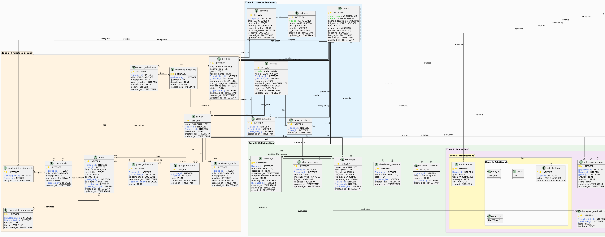

# SECTION IV - SOFTWARE DESIGN DESCRIPTION
## REVIEW CHECKLIST & COMPLETION GUIDE

**Date**: January 4, 2026  
**Purpose**: Đánh giá Section IV và hướng dẫn hoàn thiện các phần còn thiếu

---

## 📋 TEMPLATE REQUIREMENTS vs CURRENT STATUS

### Template yêu cầu Section IV gồm 3 phần:

#### ✅ **4.1. System Design** - Thiết kế hệ thống
- Architecture overview
- High-level diagram

#### ✅ **4.2. Database Design** - Thiết kế cơ sở dữ liệu  
- ERD
- Schema tables

#### ✅ **4.3. Detailed Design** - Thiết kế chi tiết
- Class diagrams
- Sequence diagrams
- GUI mockups

---

## ✅ PHẦN ĐÃ HOÀN THÀNH (TEXT DOCUMENTATION)

### 1. Master File: 04-SDD.md ✅
**Status**: Complete  
**Lines**: 356  
**Content**:
- ✅ Document Information table
- ✅ Table of Contents với links
- ✅ Document Overview
- ✅ Architectural Patterns (3-Tier, MVC, Component-Based)
- ✅ Technology Stack summary
- ✅ Design Principles (SOLID, DRY, KISS)
- ✅ System Constraints
- ✅ Assumptions & Dependencies
- ✅ Revision History
- ✅ Approval Section

**Quality**: Excellent - Follows template structure

---

### 2. File 4.1-SystemDesign.md ✅
**Status**: Complete  
**Lines**: 740 (46 KB)  
**Estimated Pages**: ~20 pages

**Content Coverage**:

#### ✅ 4.1.1 System Architecture Overview
- [x] 3-Tier architecture description
- [x] ASCII diagram showing Client → Nginx → Application → Database
- [x] Layer responsibilities explained
- [x] Component interactions

#### ✅ 4.1.2 Technology Stack
- [x] Frontend stack table (React 18.2+, MUI, TailwindCSS, Axios, Socket.IO)
- [x] Backend stack table (FastAPI 0.104+, SQLModel, Pydantic, Alembic)
- [x] Database stack (PostgreSQL 15)
- [x] DevOps stack (Docker, Nginx)
- [x] Version numbers and purposes

#### ✅ 4.1.3 Component Architecture
- [x] Frontend folder structure (src/components/, pages/, services/)
- [x] Backend folder structure (app/routers/, models/, utils/)
- [x] Component responsibilities

#### ✅ 4.1.4 Deployment Architecture
- [x] Docker Compose setup (3 containers)
- [x] Development environment
- [x] Production cloud architecture
- [x] Port mappings

#### ✅ 4.1.5 Communication Protocols
- [x] HTTP/HTTPS REST API (Port 443)
- [x] WebSocket with Socket.IO (real-time chat)
- [x] WebRTC (video calls)
- [x] Protocol flow descriptions

#### ✅ 4.1.6 Security Architecture
- [x] JWT authentication flow (ASCII diagram)
- [x] RBAC hierarchy (5 roles)
- [x] Password hashing (bcrypt)
- [x] Token refresh mechanism

#### ✅ 4.1.7 Error Handling Strategy
- [x] HTTP status codes table
- [x] Exception handling flow
- [x] Error response format

#### ✅ 4.1.8 Scalability Considerations
- [x] Horizontal scaling strategy
- [x] Load balancing
- [x] Caching (Redis)
- [x] Database connection pooling

#### ✅ 4.1.9 Monitoring & Logging
- [x] Application metrics
- [x] Infrastructure metrics
- [x] Logging configuration

**Quality**: Excellent - Comprehensive architecture documentation

---

### 3. File 4.2-DatabaseDesign.md ✅
**Status**: Complete  
**Lines**: 1,178 (54 KB)  
**Estimated Pages**: ~30 pages

**Content Coverage**:

#### ✅ 4.2.1 Database Overview
- [x] PostgreSQL 15 specification
- [x] Database name: collabsphere_db
- [x] 28 tables in 6 logical groups
- [x] SQLModel ORM explanation

#### ✅ 4.2.2 ERD Conceptual Model (High-level)
- [x] Entity relationships description
- [x] 6 main modules:
  * Users & Authentication
  * Academic Management (Subjects, Classes)
  * Projects & Milestones
  * Groups & Workspaces
  * Collaboration (Chat, Meetings, Resources)
  * Evaluation (Peer Reviews, Assessments)

#### ✅ 4.2.3 ERD Logical Model
- [x] Detailed relationships with cardinality (1:1, 1:N, M:N)
- [x] Primary keys, Foreign keys
- [x] Business rules embedded

#### ✅ 4.2.4 ERD Physical Model (COMPLETE - All 28 tables)

**Tables 1-5: Users & Academic** ✅
- [x] Table 1: `users` (12 columns, 2 unique indexes on username/email)
- [x] Table 2: `subjects` (6 columns, unique code)
- [x] Table 3: `curricula` (7 columns)
- [x] Table 4: `classes` (11 columns, composite index)
- [x] Table 5: `class_members` (6 columns, unique constraint)

**Tables 6-13: Projects & Groups** ✅
- [x] Table 6: `projects` (13 columns, FK to users)
- [x] Table 7: `project_milestones` (7 columns)
- [x] Table 8: `class_projects` (4 columns, junction table)
- [x] Table 9: `groups` (9 columns, leader FK)
- [x] Table 10: `group_members` (7 columns, contribution_score)
- [x] Table 11: `group_milestones` (9 columns, status tracking)
- [x] Table 12: `checkpoints` (8 columns, submission tracking)
- [x] Table 13: `tasks` (11 columns, Kanban board)

**Tables 14-19: Collaboration** ✅
- [x] Table 14: `meetings` (9 columns, scheduled events)
- [x] Table 15: `meeting_participants` (5 columns)
- [x] Table 16: `chat_messages` (8 columns, real-time)
- [x] Table 17: `resources` (10 columns, file storage)
- [x] Table 18: `whiteboard_sessions` (7 columns)
- [x] Table 19: `document_sessions` (7 columns)

**Tables 20-25: Evaluation** ✅
- [x] Table 20: `peer_reviews` (9 columns, anonymous)
- [x] Table 21: `group_evaluations` (8 columns)
- [x] Table 22: `member_evaluations` (7 columns)
- [x] Table 23: `checkpoint_evaluations` (7 columns)
- [x] Table 24: `milestone_questions` (7 columns)
- [x] Table 25: `milestone_answers` (7 columns)

**Tables 26-28: Additional** ✅
- [x] Table 26: `notifications` (9 columns, composite index)
- [x] Table 27: `project_tags` (4 columns)
- [x] Table 28: `activity_logs` (8 columns, audit trail)

**Each table specification includes**:
- Column name, Data type, Constraints (PK, FK, NOT NULL, UNIQUE)
- Default values
- Indexes (40+ total indexes documented)
- Relationships description

#### ✅ 4.2.5 Database Optimization
- [x] Index strategies (Single-column, Composite, Unique)
- [x] Query optimization examples
- [x] Connection pooling configuration
- [x] Performance best practices

#### ✅ 4.2.6 Backup & Recovery
- [x] RTO: <4 hours
- [x] RPO: <1 day
- [x] Backup scripts (daily full, hourly incremental)
- [x] Recovery procedures

#### ✅ 4.2.7 Database Migrations
- [x] Alembic configuration
- [x] Migration example code
- [x] Upgrade/downgrade procedures

#### ✅ 4.2.8 Database Security
- [x] Access control (3 user types)
- [x] Encryption (TLS/SSL, at-rest)
- [x] Audit logging
- [x] SQL injection prevention (ORM)

#### ✅ 4.2.9 Monitoring
- [x] Performance queries (slow query log)
- [x] Capacity metrics
- [x] Health check procedures

**Quality**: Excellent - Complete database specifications

---

### 4. File 4.3-DetailedDesign.md ✅
**Status**: Complete  
**Lines**: 2,191 (64 KB)  
**Estimated Pages**: ~35 pages

**Content Coverage**:

#### ✅ 4.3.1 API Design Overview
- [x] Base URL: `/api/v1`
- [x] RESTful architecture
- [x] JSON data format
- [x] JWT authentication
- [x] Standard response formats (success/error)
- [x] HTTP methods table

#### ✅ 4.3.2 API Endpoints Catalog (60+ endpoints)

**Module A: Authentication** ✅ (5 endpoints)
- [x] POST /auth/register
- [x] POST /auth/login
- [x] POST /auth/refresh
- [x] GET /auth/me
- [x] PUT /auth/change-password

**Module B: Users Management** ✅ (5 endpoints)
- [x] GET /users
- [x] GET /users/{id}
- [x] PUT /users/{id}
- [x] POST /users (Admin)
- [x] DELETE /users/{id}

**Module C: Subjects & Curricula** ✅ (4 endpoints)
- [x] POST /subjects
- [x] GET /subjects
- [x] POST /subjects/{id}/curricula
- [x] GET /subjects/{id}/curricula

**Module D: Classes** ✅ (4 endpoints)
- [x] POST /classes
- [x] GET /classes
- [x] POST /classes/{id}/members
- [x] GET /classes/{id}/members

**Module E: Projects** ✅ (7 endpoints)
- [x] POST /projects
- [x] GET /projects
- [x] POST /projects/{id}/submit
- [x] POST /projects/{id}/approve
- [x] POST /projects/{id}/reject
- [x] POST /projects/{id}/milestones
- [x] POST /projects/{id}/milestones/generate-ai

**Module F: Groups & Workspaces** ✅ (10 endpoints)
- [x] POST /groups
- [x] GET /groups/{id}
- [x] POST /groups/{id}/members
- [x] POST /groups/{id}/milestones
- [x] PUT /groups/{id}/milestones/{mid}/complete
- [x] POST /groups/{id}/checkpoints
- [x] POST /groups/{id}/checkpoints/{cid}/submit
- [x] GET /groups/{id}/tasks
- [x] POST /groups/{id}/tasks
- [x] PUT /groups/{id}/tasks/{tid}

**Module G: Evaluations** ✅ (4 endpoints)
- [x] POST /evaluations/groups/{id}
- [x] POST /evaluations/members/{id}
- [x] POST /evaluations/peer-review
- [x] GET /evaluations/me

**Module H: Chat & Meetings** ✅ (4 endpoints)
- [x] GET /chat/groups/{id}/messages
- [x] POST /chat/groups/{id}/messages
- [x] POST /meetings
- [x] GET /meetings

**Module I: Resources** ✅ (3 endpoints)
- [x] POST /resources (file upload)
- [x] GET /resources
- [x] DELETE /resources/{id}

**Module J: AI Assistant** ✅ (2 endpoints)
- [x] POST /ai/chat
- [x] POST /ai/projects/{id}/generate-milestones

**Module K: Notifications** ✅ (3 endpoints)
- [x] GET /notifications
- [x] PUT /notifications/{id}/read
- [x] PUT /notifications/read-all

**Each endpoint includes**:
- [x] Purpose description
- [x] Authentication requirement (✅/❌)
- [x] Request body (JSON schema with examples)
- [x] Response format (JSON with examples)
- [x] HTTP status codes
- [x] Error responses
- [x] Business rules (BR-XX references)

#### ✅ 4.3.3 Business Logic Flows
- [x] Flow 1: User Registration & Login (5 steps)
- [x] Flow 2: Project Approval Workflow (4 stages)
- [x] Flow 3: Group Milestone Tracking (4 phases)
- [x] Flow 4: Peer Review Process (anonymous, 4 steps)
- [x] Flow 5: Real-time Chat with WebSocket (4 steps)

#### ✅ 4.3.4 Security Design
- [x] Authentication flow diagram (ASCII sequence)
- [x] RBAC authorization matrix (15 endpoints × 5 roles)
- [x] Input validation (Pydantic schemas with examples)
- [x] SQL injection prevention (ORM usage)
- [x] XSS prevention (React escaping)
- [x] CSRF protection strategy

#### ✅ 4.3.5 Class Design
- [x] Backend SQLModel classes (User, Project, Group with full code)
- [x] Frontend React components (LoginForm, ProjectCard, GroupWorkspace)
- [x] Reference to 02-CLASS-GUIDE.md (766 lines)

#### ✅ 4.3.6 Sequence Diagrams
- [x] Authentication sequence (ASCII art)
- [x] Project approval workflow sequence
- [x] Real-time chat sequence
- [x] Peer review submission sequence
- [x] AI milestone generation sequence
- [x] Reference to 03-SEQUENCE-GUIDE.md

#### ✅ 4.3.7 Component Interaction Design
- [x] Frontend state management (AuthContext code)
- [x] Service layer (API calls with interceptors)
- [x] Token refresh logic (automatic retry)

#### ✅ 4.3.8 Error Handling Strategy
- [x] Backend exception classes (Python code)
- [x] Frontend error handler (JavaScript code)
- [x] Toast notification integration

#### ✅ 4.3.9 Performance Optimization
- [x] Database query optimization (eager loading examples)
- [x] Caching strategy (FastAPI-cache)
- [x] Pagination implementation
- [x] Code splitting (React lazy loading)
- [x] React Query for data fetching
- [x] Virtualization for large lists

#### ✅ 4.3.10 Testing Considerations
- [x] Backend unit tests (pytest examples)
- [x] Frontend component tests (Jest + RTL examples)

#### ✅ 4.3.11 Deployment Configuration
- [x] Docker Compose (YAML with 3 services)
- [x] Environment variables (.env.production)

#### ✅ 4.3.12 References
- [x] Internal documentation links
- [x] Technology documentation URLs
- [x] API standards references

**Quality**: Excellent - Comprehensive API & logic documentation

---

## ❌ PHẦN CHƯA HOÀN THÀNH (VISUAL DIAGRAMS)

### ⚠️ CRITICAL: Section IV thiếu các diagrams hình ảnh

Template yêu cầu:
- **High-level diagram** (System Design)
- **ERD diagram** (Database Design)
- **Class diagrams** (Detailed Design)
- **Sequence diagrams** (Detailed Design)
- **GUI mockups** (Detailed Design)

**Hiện tại**: Chỉ có mô tả bằng TEXT và ASCII ART, chưa có diagrams chuyên nghiệp

---

## 📝 DANH SÁCH CÔNG VIỆC CẦN LÀM (USER MANUAL WORK)

### Priority 1: Diagrams cho Section 4.1 (System Design)

#### 🎯 Diagram 1: System Architecture Diagram (BẮT BUỘC)
**File cần tạo**: `Documentation/04-SDD/diagrams/4.1-system-architecture.png`

**Nội dung cần vẽ**:
- 3-Tier Architecture (Presentation → Application → Data)
- Các components chính:
  * Client Layer (React SPA, Browser)
  * Web Server (Nginx)
  * Application Layer (FastAPI + Python)
  * Data Layer (PostgreSQL 15)
- Communication protocols (HTTP/HTTPS, WebSocket, WebRTC)
- External services (AWS Bedrock, Cloudinary, SMTP)

**Công cụ đề xuất**:
- **Draw.io** (https://app.diagrams.net/) - FREE, online
- **Lucidchart** (https://www.lucidchart.com/) - Free tier
- **Microsoft Visio** (nếu có license)

**Tham khảo từ**:
- File: `Documentation/04-SDD/4.1-SystemDesign.md` (dòng 20-80)
- Diagrams guide: `Documentation/diagrams/04-ARCHITECTURE-GUIDE.md` (576 dòng)

**Hướng dẫn vẽ với Draw.io**:
1. Mở https://app.diagrams.net/
2. Chọn "Create New Diagram"
3. Template: "Software Architecture" → "3-Tier Architecture"
4. Thêm shapes:
   - Rounded rectangles cho layers (Client, Application, Data)
   - Cylinders cho Database
   - Cloud shapes cho external services
5. Arrows: Sử dụng labeled arrows cho communication protocols
6. Export: File → Export as → PNG (resolution 300 DPI)

**Kích thước**: 1920x1080 pixels hoặc A4 landscape

**Vị trí chèn**: Sau section 4.1.1 trong file `4.1-SystemDesign.md`

---

### Priority 2: Diagrams cho Section 4.2 (Database Design)

#### 🎯 Diagram 2: ERD - Entity Relationship Diagram (BẮT BUỘC)
**File cần tạo**: `Documentation/04-SDD/diagrams/4.2-erd-full.png`

**Nội dung cần vẽ**: ERD của TẤT CẢ 28 tables

**Tables phải có trong diagram**:
1. Users & Academic (5 tables):
   - users, subjects, curricula, classes, class_members

2. Projects & Groups (8 tables):
   - projects, project_milestones, class_projects, groups, group_members, group_milestones, checkpoints, tasks

3. Collaboration (6 tables):
   - meetings, meeting_participants, chat_messages, resources, whiteboard_sessions, document_sessions

4. Evaluation (6 tables):
   - peer_reviews, group_evaluations, member_evaluations, checkpoint_evaluations, milestone_questions, milestone_answers

5. Additional (3 tables):
   - notifications, project_tags, activity_logs

**Thông tin mỗi table phải hiển thị**:
- Table name
- Primary Key (PK) - màu vàng/gold
- Foreign Keys (FK) - màu xanh/blue
- Important columns (NOT NULL, UNIQUE)
- Data types (VARCHAR, INT, TIMESTAMP, etc.)

**Relationships phải thể hiện**:
- One-to-Many (1:N) - crow's foot notation
- Many-to-Many (M:N) - qua junction tables
- Cardinality (0..1, 1..1, 0..*, 1..*)

**Công cụ đề xuất**:

**Option A: MySQL Workbench** (BEST - tự động từ database)
1. Download: https://dev.mysql.com/downloads/workbench/
2. Connect to PostgreSQL (qua ODBC driver)
3. Database → Reverse Engineer
4. Select all 28 tables
5. Auto-generate ERD
6. Adjust layout (group by modules)
7. Export: File → Export → PNG

**Option B: Draw.io** (Manual vẽ)
1. Mở https://app.diagrams.net/
2. Template: "Entity Relationship"
3. Shapes: Use "Entity Relationship" stencil
4. Vẽ từng table với cấu trúc:
   ```
   ┌─────────────────┐
   │ TABLE_NAME      │
   ├─────────────────┤
   │ PK id: int      │
   │ FK user_id: int │
   │    name: varchar│
   │    email: varchar│
   └─────────────────┘
   ```
5. Kết nối relationships bằng connectors
6. Group theo modules (màu nền khác nhau)

**Option C: dbdiagram.io** (Code-based, FAST)
1. Truy cập: https://dbdiagram.io/
2. Paste DBML code (tôi sẽ generate cho bạn nếu cần)
3. Auto-render ERD
4. Export: Export → PNG/PDF

**Tham khảo từ**:
- File: `Documentation/04-SDD/4.2-DatabaseDesign.md` (tất cả 28 tables từ dòng 100-900)
- ERD details: `ERD_DATABASE_DESIGN_COLLABSPHERE.md` (911 dòng - có sẵn PlantUML code!)

**⚠️ TIP QUAN TRỌNG**: File `ERD_DATABASE_DESIGN_COLLABSPHERE.md` ĐÃ CÓ PlantUML code!
- Đường dẫn: `C:\Users\LENOVO\Desktop\SE\ERD_DATABASE_DESIGN_COLLABSPHERE.md`
- Có thể dùng PlantUML online: http://www.plantuml.com/plantuml/
- Paste code vào, generate diagram, export PNG

**Kích thước**: A3 landscape (4961x3508 pixels) - vì có 28 tables

**Vị trí chèn**: Sau section 4.2.3 trong file `4.2-DatabaseDesign.md`

---

#### 🎯 Diagram 3: ERD - Conceptual Model (OPTIONAL but recommended)
**File cần tạo**: `Documentation/04-SDD/diagrams/4.2-erd-conceptual.png`

**Nội dung**: ERD đơn giản chỉ hiển thị 6 entity groups và relationships chính
- Users ← Academic ← Projects ← Groups ← Collaboration
- Groups → Evaluation

**Vị trí chèn**: Sau section 4.2.2 trong file `4.2-DatabaseDesign.md`

---

### Priority 3: Diagrams cho Section 4.3 (Detailed Design)

#### 🎯 Diagram 4-9: Class Diagrams (6 diagrams - BẮT BUỘC)
**Files cần tạo**:
1. `Documentation/04-SDD/diagrams/4.3-class-user.png`
2. `Documentation/04-SDD/diagrams/4.3-class-academic.png`
3. `Documentation/04-SDD/diagrams/4.3-class-project.png`
4. `Documentation/04-SDD/diagrams/4.3-class-group.png`
5. `Documentation/04-SDD/diagrams/4.3-class-communication.png`
6. `Documentation/04-SDD/diagrams/4.3-class-evaluation.png`

**Nội dung mỗi diagram**:
- Classes với attributes (private/public)
- Methods (public/private)
- Relationships (inheritance, composition, aggregation)
- Multiplicity

**Công cụ đề xuất**:
- **PlantUML** (BEST - code-based): http://www.plantuml.com/plantuml/
- **Visual Paradigm Online** (FREE): https://online.visual-paradigm.com/
- **Draw.io**: Class Diagram template

**Tham khảo từ**:
- File: `Documentation/diagrams/02-CLASS-GUIDE.md` (766 dòng - ĐÃ CÓ PlantUML CODE!)
- File: `Documentation/04-SDD/4.3-DetailedDesign.md` (section 4.3.5)

**⚠️ TIP QUAN TRỌNG**: File `02-CLASS-GUIDE.md` ĐÃ CÓ PlantUML code hoàn chỉnh!
- Đường dẫn: `C:\Users\LENOVO\Desktop\SE\Documentation\diagrams\02-CLASS-GUIDE.md`
- Chỉ cần paste vào PlantUML online → Generate → Export PNG

**Hướng dẫn với PlantUML**:
1. Mở: http://www.plantuml.com/plantuml/
2. Copy PlantUML code từ `02-CLASS-GUIDE.md` (từng module)
3. Paste vào editor
4. Xem preview tự động render
5. Download PNG (button ở góc phải)

**Vị trí chèn**: Sau section 4.3.5 trong file `4.3-DetailedDesign.md`

---

#### 🎯 Diagram 10-19: Sequence Diagrams (10 diagrams - BẮT BUỘC)
**Files cần tạo**:
1. `Documentation/04-SDD/diagrams/4.3-seq-authentication.png`
2. `Documentation/04-SDD/diagrams/4.3-seq-registration.png`
3. `Documentation/04-SDD/diagrams/4.3-seq-project-approval.png`
4. `Documentation/04-SDD/diagrams/4.3-seq-group-creation.png`
5. `Documentation/04-SDD/diagrams/4.3-seq-milestone-tracking.png`
6. `Documentation/04-SDD/diagrams/4.3-seq-peer-review.png`
7. `Documentation/04-SDD/diagrams/4.3-seq-chat-realtime.png`
8. `Documentation/04-SDD/diagrams/4.3-seq-file-upload.png`
9. `Documentation/04-SDD/diagrams/4.3-seq-ai-generation.png`
10. `Documentation/04-SDD/diagrams/4.3-seq-notification.png`

**Nội dung mỗi diagram**:
- Actors (User, System, Database)
- Lifelines (vertical dashed lines)
- Messages (arrows) với labels
- Return messages (dashed arrows)
- Activation boxes

**Công cụ đề xuất**:
- **PlantUML** (BEST): http://www.plantuml.com/plantuml/
- **SequenceDiagram.org** (online, simple): https://sequencediagram.org/
- **Draw.io**: Sequence Diagram template

**Tham khảo từ**:
- File: `Documentation/diagrams/03-SEQUENCE-GUIDE.md` (ĐÃ CÓ PlantUML CODE!)
- File: `Documentation/04-SDD/4.3-DetailedDesign.md` (section 4.3.6 - có ASCII art)

**⚠️ TIP QUAN TRỌNG**: File `03-SEQUENCE-GUIDE.md` ĐÃ CÓ PlantUML code!
- Đường dẫn: `C:\Users\LENOVO\Desktop\SE\Documentation\diagrams\03-SEQUENCE-GUIDE.md`

**Vị trí chèn**: Sau section 4.3.6 trong file `4.3-DetailedDesign.md`

---

#### 🎯 Diagram 20-49: GUI Mockups / Screenshots (30 screens - BẮT BUỘC)
**Files cần tạo**: `Documentation/04-SDD/diagrams/gui/` (30 PNG files)

**Danh sách screens cần capture**:

**Authentication (3 screens)**:
1. `4.3-gui-01-login.png` - Login form
2. `4.3-gui-02-register.png` - Registration form
3. `4.3-gui-03-forgot-password.png` - Password reset

**Admin Dashboard (3 screens)**:
4. `4.3-gui-04-admin-dashboard.png` - Admin home
5. `4.3-gui-05-admin-users.png` - User management
6. `4.3-gui-06-admin-subjects.png` - Subject management

**Staff Dashboard (2 screens)**:
7. `4.3-gui-07-staff-classes.png` - Class management
8. `4.3-gui-08-staff-curricula.png` - Curriculum management

**Head Dashboard (3 screens)**:
9. `4.3-gui-09-head-projects.png` - Project approval list
10. `4.3-gui-10-head-project-detail.png` - Project review form
11. `4.3-gui-11-head-statistics.png` - System statistics

**Lecturer Dashboard (5 screens)**:
12. `4.3-gui-12-lecturer-dashboard.png` - Lecturer home
13. `4.3-gui-13-lecturer-create-project.png` - Create project form
14. `4.3-gui-14-lecturer-my-projects.png` - My projects list
15. `4.3-gui-15-lecturer-classes.png` - My classes
16. `4.3-gui-16-lecturer-evaluation.png` - Evaluate group form

**Student Dashboard (14 screens)**:
17. `4.3-gui-17-student-dashboard.png` - Student home
18. `4.3-gui-18-student-my-class.png` - My class view
19. `4.3-gui-19-student-group-workspace.png` - Group workspace (main view)
20. `4.3-gui-20-student-kanban.png` - Kanban board (tasks)
21. `4.3-gui-21-student-milestones.png` - Milestone timeline
22. `4.3-gui-22-student-chat.png` - Group chat
23. `4.3-gui-23-student-video-call.png` - Video conference
24. `4.3-gui-24-student-whiteboard.png` - Collaborative whiteboard
25. `4.3-gui-25-student-resources.png` - Resource library
26. `4.3-gui-26-student-meetings.png` - Meeting scheduler
27. `4.3-gui-27-student-peer-review.png` - Peer review form
28. `4.3-gui-28-student-notifications.png` - Notifications panel
29. `4.3-gui-29-student-ai-chat.png` - AI assistant chat
30. `4.3-gui-30-student-profile.png` - User profile settings

**Cách tạo GUI mockups**:

**Option A: Screenshots từ ứng dụng đang chạy** (RECOMMENDED)
1. Chạy collabsphere application:
   ```powershell
   cd C:\Users\LENOVO\Desktop\SE\collabsphere
   docker-compose up
   ```
2. Truy cập: http://localhost:3000
3. Login với các role khác nhau
4. Capture screenshots:
   - Windows: Win + Shift + S
   - Hoặc: Snipping Tool
5. Crop và resize: 1920x1080 pixels
6. Save vào `Documentation/04-SDD/diagrams/gui/`

**Option B: Wireframes với Figma** (nếu app chưa hoàn chỉnh)
1. Truy cập: https://www.figma.com/
2. Tạo Free account
3. New Design File → Desktop (1920x1080)
4. Dùng templates: Material Design hoặc Bootstrap
5. Vẽ wireframes cho 30 screens
6. Export: File → Export → PNG (2x resolution)

**Option C: Mockups với Balsamiq** (Quick & Dirty)
1. Download: https://balsamiq.com/wireframes/
2. Free trial 30 days
3. Vẽ low-fidelity wireframes
4. Export PNG

**Vị trí chèn**: 
- Tạo section mới `4.3.13 GUI Design` trong file `4.3-DetailedDesign.md`
- Hoặc tạo file riêng: `4.3-GUIDesign.md`

---

### Priority 4: Cập nhật files documentation để chèn diagrams

Sau khi tạo xong diagrams, cần **chèn vào files Markdown**:

#### File 4.1-SystemDesign.md cần thêm:
```markdown
## 4.1.1. System Architecture Overview

[Existing text...]

### Architecture Diagram


*Figure 4.1: CollabSphere 3-Tier System Architecture*

[Continue with existing text...]
```

#### File 4.2-DatabaseDesign.md cần thêm:
```markdown
## 4.2.3. ERD Logical Model

[Existing text...]

### Complete ERD Diagram


*Figure 4.2: CollabSphere Complete Entity Relationship Diagram (28 Tables)*

[Continue with existing text...]
```

#### File 4.3-DetailedDesign.md cần thêm:
```markdown
## 4.3.5. Class Design

[Existing text...]

### Class Diagrams

#### User Module Classes

*Figure 4.3.1: User and Authentication Classes*

[... thêm 5 diagrams khác tương tự ...]

## 4.3.6. Sequence Diagrams

[Existing text...]

### Authentication Flow

*Figure 4.3.7: User Authentication Sequence Diagram*

[... thêm 9 diagrams khác tương tự ...]

## 4.3.13. GUI Design (NEW SECTION)

### User Interface Screenshots

#### Authentication Screens

*Figure 4.3.20: Login Screen*

[... thêm 29 screenshots khác ...]
```

---

## 📊 TỔNG KẾT CÔNG VIỆC CẦN LÀM

### Checklist đầy đủ:

#### Phase 1: Chuẩn bị (30 phút)
- [ ] Cài đặt Draw.io desktop (hoặc dùng online)
- [ ] Cài đặt MySQL Workbench (cho ERD)
- [ ] Tạo thư mục: `Documentation/04-SDD/diagrams/`
- [ ] Tạo thư mục: `Documentation/04-SDD/diagrams/gui/`
- [ ] Đọc kỹ các file tham khảo

#### Phase 2: System Architecture (2 giờ)
- [ ] Vẽ System Architecture Diagram (1 diagram)
- [ ] Export PNG 1920x1080
- [ ] Chèn vào `4.1-SystemDesign.md`

#### Phase 3: Database ERD (3 giờ)
- [ ] Sử dụng PlantUML từ `ERD_DATABASE_DESIGN_COLLABSPHERE.md`
- [ ] Generate ERD full (28 tables)
- [ ] Hoặc: Reverse engineer từ PostgreSQL database
- [ ] Export PNG size lớn (A3)
- [ ] Optional: Tạo ERD Conceptual (simplified)
- [ ] Chèn vào `4.2-DatabaseDesign.md`

#### Phase 4: Class Diagrams (3 giờ)
- [ ] Copy PlantUML code từ `02-CLASS-GUIDE.md`
- [ ] Generate 6 class diagrams
- [ ] Export PNG cho từng diagram
- [ ] Chèn vào `4.3-DetailedDesign.md`

#### Phase 5: Sequence Diagrams (2 giờ)
- [ ] Copy PlantUML code từ `03-SEQUENCE-GUIDE.md`
- [ ] Generate 10 sequence diagrams
- [ ] Export PNG cho từng diagram
- [ ] Chèn vào `4.3-DetailedDesign.md`

#### Phase 6: GUI Screenshots (4 giờ)
- [ ] Chạy collabsphere application
- [ ] Capture 30 screenshots (theo danh sách trên)
- [ ] Crop & resize về 1920x1080
- [ ] Save vào `diagrams/gui/`
- [ ] Tạo section 4.3.13 GUI Design
- [ ] Chèn tất cả screenshots với captions

#### Phase 7: Review & Finalize (1 giờ)
- [ ] Kiểm tra tất cả images load đúng
- [ ] Kiểm tra captions và figure numbers
- [ ] Đảm bảo quality (resolution đủ cao)
- [ ] Update Table of Contents
- [ ] Update page numbers trong 04-SDD.md

**TỔNG THỜI GIAN ƯỚC TÍNH**: 15 giờ (2 ngày làm việc)

---

## 🎯 QUICK START GUIDE

### Bắt đầu NGAY với công việc dễ nhất:

#### STEP 1: Generate Class Diagrams (30 phút)
1. Mở: http://www.plantuml.com/plantuml/
2. Mở file: `C:\Users\LENOVO\Desktop\SE\Documentation\diagrams\02-CLASS-GUIDE.md`
3. Copy PlantUML code của User Module (tìm `@startuml`)
4. Paste vào PlantUML online
5. Click "Download PNG"
6. Lưu thành `4.3-class-user.png`
7. Lặp lại cho 5 modules khác

**✅ Done! Xong 6 diagrams trong 30 phút**

#### STEP 2: Generate Sequence Diagrams (30 phút)
1. Mở: http://www.plantuml.com/plantuml/
2. Mở file: `C:\Users\LENOVO\Desktop\SE\Documentation\diagrams\03-SEQUENCE-GUIDE.md`
3. Copy PlantUML code của từng sequence
4. Generate và download PNG
5. Lưu với tên tương ứng

**✅ Done! Xong 10 diagrams trong 30 phút**

#### STEP 3: Generate ERD (30 phút)
1. Mở: http://www.plantuml.com/plantuml/
2. Mở file: `C:\Users\LENOVO\Desktop\SE\ERD_DATABASE_DESIGN_COLLABSPHERE.md`
3. Copy PlantUML code
4. Generate ERD
5. Download PNG (có thể cần zoom out để thấy hết 28 tables)

**✅ Done! Xong ERD trong 30 phút**

**⏱️ TOTAL: 1.5 giờ → Hoàn thành 17/38 diagrams!**

---

## 📋 FINAL CHECKLIST

Sau khi hoàn thành tất cả, Section IV cần có:

### Documentation Files ✅
- [x] 04-SDD.md (Master file)
- [x] 4.1-SystemDesign.md (~20 pages)
- [x] 4.2-DatabaseDesign.md (~30 pages)
- [x] 4.3-DetailedDesign.md (~35 pages)

### Visual Diagrams (CẦN LÀM)
- [ ] 1 System Architecture Diagram
- [ ] 1 Complete ERD (28 tables)
- [ ] 6 Class Diagrams
- [ ] 10 Sequence Diagrams
- [ ] 30 GUI Screenshots/Mockups

### Integration (CẦN LÀM)
- [ ] Tất cả diagrams được chèn vào files Markdown
- [ ] Figure numbers tuần tự (Figure 4.1, 4.2, ...)
- [ ] Captions đầy đủ cho mỗi diagram
- [ ] Image paths chính xác (relative paths)
- [ ] Images resolution đủ cao (không bị mờ khi in)

**KHI NÀO SECTION IV HOÀN CHỈNH 100%?**
✅ Khi tất cả checkboxes trên được đánh dấu ✅

---

## 🆘 HỖ TRỢ

Nếu gặp vấn đề:
1. **PlantUML không render**: Check syntax, đảm bảo `@startuml` và `@enduml` đầy đủ
2. **ERD quá lớn**: Chia thành nhiều diagrams nhỏ theo modules
3. **GUI chưa có**: Dùng wireframes hoặc mockups tạm thời
4. **Không biết vẽ**: Tham khảo mẫu từ các open-source projects trên GitHub

---

**GOOD LUCK! 🚀 Sau khi hoàn thành diagrams, Section IV sẽ đạt 100% theo Template.md**
