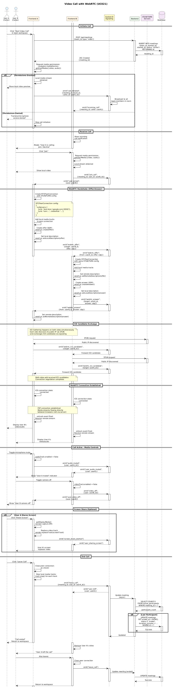

# 📖 INDEX - TÀI LIỆU CHÍNH COLLABSPHERE

**Navigation nhanh cho toàn bộ tài liệu**

---

## 📋 QUICK NAVIGATION

### 🎯 Main Sections

| Section | File | Trang | Status | Link |
|---------|------|-------|--------|------|
| **0** | Front Matter | 10 | 90% | [00-FrontMatter.md](00-FrontMatter.md) |
| **I** | Project Introduction | 35 | 100% | [01-ProjectIntroduction.md](01-ProjectIntroduction.md) |
| **II** | Project Management Plan | 25 | 95% | [02-ProjectManagementPlan.md](02-ProjectManagementPlan.md) |
| **III** | Software Requirements | 88 | 100% | [03-SRS/](03-SRS/) |
| **IV** | Software Design | 85 | 100% | [04-SDD/](04-SDD/) |
| **V** | Testing Documentation | 25 | 0% | ⚠️ TBD |
| **VI** | User Guides | 35 | 0% | ⚠️ TBD |

---

## 📄 SECTION DETAILS

### Section 0: Front Matter
📄 [00-FrontMatter.md](00-FrontMatter.md)

**Nội dung**:
- Cover Page
- Table of Contents (7 sections)
- Team Information
- Acknowledgement
- Definition & Acronyms

**Jump to**:
- [Cover Page](00-FrontMatter.md#cover-page)
- [TOC](00-FrontMatter.md#table-of-contents)
- [Team Info](00-FrontMatter.md#team-information)

---

### Section I: Project Introduction
📄 [01-ProjectIntroduction.md](01-ProjectIntroduction.md)

**Nội dung**:
- 1.1 [Overview](01-ProjectIntroduction.md#11-overview)
- 1.2 [Product Background](01-ProjectIntroduction.md#12-product-background)
- 1.3 [Existing Systems Analysis](01-ProjectIntroduction.md#13-existing-systems-analysis)
- 1.4 [Business Opportunity](01-ProjectIntroduction.md#14-business-opportunity)
- 1.5 [Software Product Vision](01-ProjectIntroduction.md#15-software-product-vision)
- 1.6 [Project Scope](01-ProjectIntroduction.md#16-project-scope)
- 1.7 [Project Stakeholders](01-ProjectIntroduction.md#17-project-stakeholders)
- 1.8 [Success Criteria](01-ProjectIntroduction.md#18-success-criteria)

**Key Info**:
- 72 Features
- 5 User Roles
- 8 Modules

---

### Section II: Project Management Plan
📄 [02-ProjectManagementPlan.md](02-ProjectManagementPlan.md)

**Nội dung**:
- 2.1 [Work Breakdown Structure](02-ProjectManagementPlan.md#21-work-breakdown-structure)
- 2.2 [Management Approach](02-ProjectManagementPlan.md#22-management-approach)
- 2.3 [Project Deliverables](02-ProjectManagementPlan.md#23-project-deliverables)
- 2.4 [Responsibility Assignments](02-ProjectManagementPlan.md#24-responsibility-assignments)
- 2.5 [Communications Plan](02-ProjectManagementPlan.md#25-communications-plan)
- 2.6 [Configuration Management](02-ProjectManagementPlan.md#26-configuration-management)
- 2.7 [Risk Management](02-ProjectManagementPlan.md#27-risk-management)
- 2.8 [Quality Assurance](02-ProjectManagementPlan.md#28-quality-assurance)

**Key Metrics**:
- 350 man-days
- 9 weeks timeline
- 10 work packages
- Agile/Scrum methodology

---

### Section III: Software Requirements Specification
📁 [03-SRS/](03-SRS/)

#### 3.1 Product Overview
📄 [3.1-ProductOverview.md](03-SRS/3.1-ProductOverview.md)

**Nội dung**:
- System name, purpose, target users
- System Context Diagram
- Module Structure Diagram
- Product Functions Summary
- Operating Environment
- Design & Implementation Constraints
- Assumptions & Dependencies

**Key Diagrams**:
- 
- 

---

#### 3.2 User Requirements
📄 [3.2-UserRequirements.md](03-SRS/3.2-UserRequirements.md)

**42 Use Cases**:

| Category | Use Cases | Jump to |
|----------|-----------|---------|
| Project Management | UC001-UC006 | [Link](03-SRS/3.2-UserRequirements.md#321-project-management) |
| Class Management | UC007-UC009 | [Link](03-SRS/3.2-UserRequirements.md#322-class-management) |
| Team & Workspace | UC010-UC018 | [Link](03-SRS/3.2-UserRequirements.md#323-team--workspace-management) |
| Communication | UC019-UC022 | [Link](03-SRS/3.2-UserRequirements.md#324-communication) |
| Evaluation | UC023-UC027 | [Link](03-SRS/3.2-UserRequirements.md#325-evaluation) |
| Resource | UC028-UC029 | [Link](03-SRS/3.2-UserRequirements.md#326-resource-management) |
| AI & Automation | UC030-UC031 | [Link](03-SRS/3.2-UserRequirements.md#327-ai--automation) |
| Student Views | UC032-UC042 | [Link](03-SRS/3.2-UserRequirements.md#328-student-views) |

**Key Diagrams**:
- 

---

#### 3.3 Functional Requirements
📄 [3.3-FunctionalRequirements.md](03-SRS/3.3-FunctionalRequirements.md)

**72 Features (FE-01 ~ FE-72)**:

| Module | Features | Jump to |
|--------|----------|---------|
| A. Authentication | FE-01 ~ FE-04 | [Link](03-SRS/3.3-FunctionalRequirements.md#a-authentication--user-management) |
| B. Administrative | FE-05 ~ FE-07 | [Link](03-SRS/3.3-FunctionalRequirements.md#b-administrative-functions) |
| C. Staff | FE-08 ~ FE-16 | [Link](03-SRS/3.3-FunctionalRequirements.md#c-staff-functions) |
| D. Head | FE-17 ~ FE-21 | [Link](03-SRS/3.3-FunctionalRequirements.md#d-department-head-functions) |
| E. Lecturer | FE-22 ~ FE-47 | [Link](03-SRS/3.3-FunctionalRequirements.md#e-lecturer-functions) |
| F. Student | FE-48 ~ FE-63 | [Link](03-SRS/3.3-FunctionalRequirements.md#f-student-functions) |
| G. Collaboration | FE-64 ~ FE-69 | [Link](03-SRS/3.3-FunctionalRequirements.md#g-collaboration-tools) |
| H. Notification | FE-70 ~ FE-72 | [Link](03-SRS/3.3-FunctionalRequirements.md#h-notification-system) |

---

#### 3.4 Non-Functional Requirements
📄 [3.4-NonFunctionalRequirements.md](03-SRS/3.4-NonFunctionalRequirements.md)

**22 NFRs**:
- Performance (NFR-01 ~ NFR-04)
- Security (NFR-05 ~ NFR-09)
- Usability (NFR-10 ~ NFR-12)
- Reliability (NFR-13 ~ NFR-15)
- Scalability (NFR-16 ~ NFR-18)
- Compatibility (NFR-19 ~ NFR-20)
- Maintainability (NFR-21 ~ NFR-22)

---

#### 3.5 Requirement Appendix
📄 [3.5-RequirementAppendix.md](03-SRS/3.5-RequirementAppendix.md)

**Nội dung**:
- Business Rules (BR-01 ~ BR-30)
- Data Dictionary
- Glossary
- Requirement Traceability Matrix

---

### Section IV: Software Design Description
📁 [04-SDD/](04-SDD/)

#### 4.1 System Design
📄 [4.1-SystemDesign.md](04-SDD/4.1-SystemDesign.md)

**Nội dung**:
- 4.1.1 [System Architecture Overview](04-SDD/4.1-SystemDesign.md#411-system-architecture-overview)
- 4.1.2 [Architecture Diagrams](04-SDD/4.1-SystemDesign.md#412-architecture-diagrams)
- 4.1.3 [Technology Stack](04-SDD/4.1-SystemDesign.md#413-technology-stack)
- 4.1.4 [Deployment Architecture](04-SDD/4.1-SystemDesign.md#414-deployment-architecture)
- 4.1.5 [Communication Protocols](04-SDD/4.1-SystemDesign.md#415-communication-protocols)
- 4.1.6 [Security Architecture](04-SDD/4.1-SystemDesign.md#416-security-architecture)
- 4.1.7 [Error Handling Strategy](04-SDD/4.1-SystemDesign.md#417-error-handling-strategy)
- 4.1.8 [Scalability & Performance](04-SDD/4.1-SystemDesign.md#418-scalability--performance)
- 4.1.9 [Monitoring & Logging](04-SDD/4.1-SystemDesign.md#419-monitoring--logging)

**Key Diagrams**:
- 
- 
- %20Hierarchy%20-%20CollabShere.png)

**Tech Stack**:
- Frontend: React 18.2, MUI, TailwindCSS
- Backend: FastAPI, SQLModel, Pydantic
- Database: PostgreSQL 15
- Real-time: Socket.IO, WebRTC
- AI: AWS Bedrock Claude
- Deployment: Docker, Nginx

---

#### 4.2 Database Design
📄 [4.2-DatabaseDesign.md](04-SDD/4.2-DatabaseDesign.md)

**Nội dung**:
- 4.2.1 [Database Overview](04-SDD/4.2-DatabaseDesign.md#421-database-overview)
- 4.2.2 [ERD - Conceptual Model](04-SDD/4.2-DatabaseDesign.md#422-erd---conceptual-model)
- 4.2.3 [ERD - Logical Model](04-SDD/4.2-DatabaseDesign.md#423-erd---logical-model)
- 4.2.4 [Table Specifications](04-SDD/4.2-DatabaseDesign.md#424-table-specifications)
- 4.2.5 [Indexes & Optimization](04-SDD/4.2-DatabaseDesign.md#425-indexes--optimization)
- 4.2.6 [Database Security](04-SDD/4.2-DatabaseDesign.md#426-database-security)
- 4.2.7 [Backup & Recovery](04-SDD/4.2-DatabaseDesign.md#427-backup--recovery)
- 4.2.8 [Data Migration](04-SDD/4.2-DatabaseDesign.md#428-data-migration)

**28 Tables**:

| Module | Tables | Jump to |
|--------|--------|---------|
| Users | 1 table | [Link](04-SDD/4.2-DatabaseDesign.md#4241-users--authentication-1-table) |
| Academic | 4 tables | [Link](04-SDD/4.2-DatabaseDesign.md#4242-academic-management-4-tables) |
| Projects | 9 tables | [Link](04-SDD/4.2-DatabaseDesign.md#4243-projects--groups-9-tables) |
| Collaboration | 7 tables | [Link](04-SDD/4.2-DatabaseDesign.md#4244-collaboration-tools-7-tables) |
| Evaluation | 5 tables | [Link](04-SDD/4.2-DatabaseDesign.md#4245-evaluation-assessment-5-tables) |
| Notification | 1 table | [Link](04-SDD/4.2-DatabaseDesign.md#4246-notification-system-1-table) |

**Key Diagrams**:
- 
- 
- 
- 
- 
- 
- 

---

#### 4.3 Detailed Design
📄 [4.3-DetailedDesign.md](04-SDD/4.3-DetailedDesign.md)

**Nội dung**:
- 4.3.1 [API Design Overview](04-SDD/4.3-DetailedDesign.md#431-api-design-overview)
- 4.3.2 [API Endpoints Catalog](04-SDD/4.3-DetailedDesign.md#432-api-endpoints-catalog)
- 4.3.3 [Business Logic Flows](04-SDD/4.3-DetailedDesign.md#433-business-logic-flows)
- 4.3.4 [Security Design](04-SDD/4.3-DetailedDesign.md#434-security-design)
- 4.3.5 [Class Design](04-SDD/4.3-DetailedDesign.md#435-class-design)
- 4.3.6 [Error Handling & Logging](04-SDD/4.3-DetailedDesign.md#436-error-handling--logging)
- 4.3.7 [Performance Optimization](04-SDD/4.3-DetailedDesign.md#437-performance-optimization)
- 4.3.8 [Testing Strategy](04-SDD/4.3-DetailedDesign.md#438-testing-strategy)
- 4.3.9 [Deployment Configuration](04-SDD/4.3-DetailedDesign.md#439-deployment-configuration)

**60+ API Endpoints**:

| Module | APIs | Jump to |
|--------|------|---------|
| Authentication | 5 APIs | [Link](04-SDD/4.3-DetailedDesign.md#module-a-authentication-5-apis) |
| Users | 5 APIs | [Link](04-SDD/4.3-DetailedDesign.md#module-b-users-5-apis) |
| Subjects | 4 APIs | [Link](04-SDD/4.3-DetailedDesign.md#module-c-subjects--curricula-4-apis) |
| Classes | 4 APIs | [Link](04-SDD/4.3-DetailedDesign.md#module-d-classes-4-apis) |
| Projects | 7 APIs | [Link](04-SDD/4.3-DetailedDesign.md#module-e-projects-7-apis) |
| Groups | 10 APIs | [Link](04-SDD/4.3-DetailedDesign.md#module-f-groups--workspaces-10-apis) |
| Evaluations | 4 APIs | [Link](04-SDD/4.3-DetailedDesign.md#module-g-evaluations-4-apis) |
| Chat | 4 APIs | [Link](04-SDD/4.3-DetailedDesign.md#module-h-chat--meetings-4-apis) |
| Resources | 3 APIs | [Link](04-SDD/4.3-DetailedDesign.md#module-i-resources-3-apis) |
| AI | 2 APIs | [Link](04-SDD/4.3-DetailedDesign.md#module-j-ai-assistant-2-apis) |
| Notifications | 3 APIs | [Link](04-SDD/4.3-DetailedDesign.md#module-k-notifications-3-apis) |

**Key Diagrams - Class**:
- 
- 
- 
- 
- 
- 

**Key Diagrams - Sequence**:
- 
- 
- 
- 
- 
- 
- 
- 
- 

---

### Section V: Testing Documentation
⚠️ **CHƯA CÓ** - Cần tạo `05-Testing.md`

**Nội dung sẽ có**:
- 5.1 Scope of Testing
- 5.2 Test Strategy
- 5.3 Test Plan
- 5.4 Test Cases (30-50 cases)
- 5.5 Test Reports

**Ước tính**: 25 trang, 8 giờ làm việc

---

### Section VI: User Guides
⚠️ **CHƯA CÓ** - Cần tạo `06-UserGuides.md`

**Nội dung sẽ có**:
- 6.1 Deliverable Package
- 6.2 Installation Guides
  - Backend setup
  - Frontend setup
  - Docker deployment
- 6.3 User Manual
  - Admin Guide
  - Staff Guide
  - Department Head Guide
  - Lecturer Guide
  - Student Guide

**Ước tính**: 35 trang, 12 giờ làm việc

---

## 🎨 DIAGRAMS INDEX

### All Diagrams (31 files)
📁 [Images/](Images/)  
📊 [DIAGRAMS_STATUS.md](DIAGRAMS_STATUS.md) - Chi tiết status

**Quick Links**:
- [Use Case Diagrams](#use-case-2)
- [System Design Diagrams](#system-4)
- [Database ERD](#database-7)
- [Class Diagrams](#class-6) ✅ 100%
- [Sequence Diagrams](#sequence-10) ✅ 100%

---

## 🔍 SEARCH BY KEYWORD

### By Feature ID
- FE-01 ~ FE-04: Authentication → [3.3](03-SRS/3.3-FunctionalRequirements.md#a-authentication--user-management)
- FE-05 ~ FE-07: Admin → [3.3](03-SRS/3.3-FunctionalRequirements.md#b-administrative-functions)
- FE-08 ~ FE-16: Staff → [3.3](03-SRS/3.3-FunctionalRequirements.md#c-staff-functions)
- FE-17 ~ FE-21: Head → [3.3](03-SRS/3.3-FunctionalRequirements.md#d-department-head-functions)
- FE-22 ~ FE-47: Lecturer → [3.3](03-SRS/3.3-FunctionalRequirements.md#e-lecturer-functions)
- FE-48 ~ FE-63: Student → [3.3](03-SRS/3.3-FunctionalRequirements.md#f-student-functions)
- FE-64 ~ FE-69: Collaboration → [3.3](03-SRS/3.3-FunctionalRequirements.md#g-collaboration-tools)
- FE-70 ~ FE-72: Notification → [3.3](03-SRS/3.3-FunctionalRequirements.md#h-notification-system)

### By Use Case ID
- UC001 ~ UC006: Project Management → [3.2](03-SRS/3.2-UserRequirements.md#321-project-management)
- UC007 ~ UC009: Class Management → [3.2](03-SRS/3.2-UserRequirements.md#322-class-management)
- UC010 ~ UC018: Team & Workspace → [3.2](03-SRS/3.2-UserRequirements.md#323-team--workspace-management)
- UC019 ~ UC022: Communication → [3.2](03-SRS/3.2-UserRequirements.md#324-communication)
- UC023 ~ UC027: Evaluation → [3.2](03-SRS/3.2-UserRequirements.md#325-evaluation)
- UC028 ~ UC029: Resource → [3.2](03-SRS/3.2-UserRequirements.md#326-resource-management)
- UC030 ~ UC031: AI & Automation → [3.2](03-SRS/3.2-UserRequirements.md#327-ai--automation)
- UC032 ~ UC042: Student Views → [3.2](03-SRS/3.2-UserRequirements.md#328-student-views)

### By Table Name
Xem [4.2-DatabaseDesign.md](04-SDD/4.2-DatabaseDesign.md#424-table-specifications)

### By API Endpoint
Xem [4.3-DetailedDesign.md](04-SDD/4.3-DetailedDesign.md#432-api-endpoints-catalog)

---

## 📊 DOCUMENT STATUS

```
COMPLETION PROGRESS
═══════════════════════════════════════════════════════
Section 0:  ████████████████████░  90%  ✅
Section I:  ████████████████████  100%  ✅
Section II: ███████████████████░   95%  ✅
Section III:████████████████████  100%  ✅
Section IV: ████████████████████  100%  ✅
Section V:  ░░░░░░░░░░░░░░░░░░░░    0%  ❌
Section VI: ░░░░░░░░░░░░░░░░░░░░    0%  ❌
═══════════════════════════════════════════════════════
TOTAL:      ████████████████░░░░   75%  🟡
═══════════════════════════════════════════════════════
```

---

## 🎯 NEXT ACTIONS

### Priority 1 (This Week):
- [ ] Hoàn thiện Front Matter (team info)
- [ ] Insert 31 diagrams vào docs
- [ ] Vẽ 10 diagrams còn thiếu

### Priority 2 (Next Week):
- [ ] Viết Section V - Testing
- [ ] Chụp 30 screenshots

### Priority 3 (Week 3):
- [ ] Viết Section VI - User Guides
- [ ] Final review & polish

---

**Last updated**: 20/1/2026  
**Version**: 1.0.0
